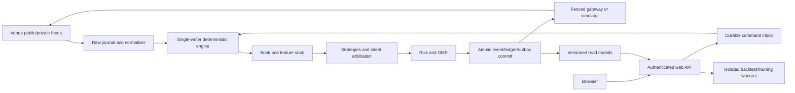

# AI Quant & Scalper Framework Implementation Plan

> **For agentic workers:** REQUIRED SUB-SKILL when available: use `superpowers:subagent-driven-development` or `superpowers:executing-plans` to implement this plan task by task. If these skills are unavailable, execute the ordered tasks and verification gates in this document directly. The document is a self-contained build brief; no further architecture interview is required.

**Goal:** Build a usable, auditable Python trading research and execution application with deterministic replay, realistic simulation, an optional ML signal filter, and a complete browser interface that a Windows user can operate without a terminal.

**Agent allocation and model policy**

The primary agent is **GPT-5.6 Sol at Extra High reasoning consulting Astra**. Sol owns the architecture,
integration, shared interfaces, implementation order, core trading logic, test
interpretation, and final acceptance. Sol must not delegate these responsibilities.

Use **GPT-5.6 Sol at High reasoning** for bounded, well-specified work with
disjoint file ownership, such as:

- React pages and ordinary frontend components
- API read models and schemas whose contracts are already defined
- dataset import/export and reporting views
- fixtures, documentation, test implementation, and reproducible verification
- targeted codebase inspection and failure reproduction

Use **GPT-5.6 Terra at High reasoning** only for high-volume, mechanical,
low-risk work with explicit acceptance criteria, such as:

- locating references and summarizing files
- generating repetitive fixtures from an established format
- running narrow test batches and classifying outputs
- formatting, inventory, or documentation consistency checks

Use **GPT-6 Astra at Extra High, escalating to Max for especially difficult issues** for independent analysis and review.
Astra does not become the routine implementation worker. Consult or assign Astra for:

- event ordering, persistence, replay, OMS, accounting, reconciliation, risk,
  native protective orders, and simulator design
- contradictions or unresolved decisions in the plan
- security and live-control review
- ML causality, labeling, validation leakage, and promotion/rollback review
- independent milestone audits after Tasks 01–08, 09–12, 13–15, and 16–18

For parallel implementation, use at most two subagents at once. Give every writer a
disjoint file scope and explicit interfaces. Sol integrates all changes and resolves
contract changes before more work begins.

If an assigned model is unavailable, use Sol for work requiring judgment or Terra
for bounded supporting work, and record the substitution in `docs/BUILD_STATUS.md`.
Do not silently downgrade Astra audit work to Luna.

**Architecture:** A single writer owns each account's trading state. Async venue adapters supply journaled inputs to a deterministic core containing the order book, features, strategies, OMS, ledger, and risk rules. A separate web control service and research workers communicate through durable commands and versioned read models; they never mutate trading state directly.

**Tech stack:** Standard CPython 3.12, asyncio, typed dataclasses, Pydantic, FastAPI, SQLite, Parquet/PyArrow, Polars, NumPy, scikit-learn, LightGBM, React, TypeScript, Vite, Playwright, pytest, Hypothesis; a Windows graphical launcher and optional Linux container deployment.

**Spec:** This document contains both the normative specification and implementation tasks. Save it in the implementation repository as `docs/IMPLEMENTATION_PLAN.md`. Intended executor: Codex GPT-5.6 Sol. Prepared 2026-09-12.

**Navigation:** [Source decisions](#2-source-grounding-and-deliberate-corrections) · [Architecture](#5-runtime-architecture-and-ownership) · [Determinism](#6-deterministic-event-model-persistence-and-replay) · [OMS](#9-oms-routing-and-protective-orders) · [Risk](#11-risk-controls-and-emergency-semantics) · [ML](#13-ml-research-drift-and-model-governance) · [Dashboard](#15-web-interface-required-user-journeys-and-api-contracts) · [Build tasks](#18-ordered-implementation-tasks) · [Fault tests](#20-mandatory-fault-injection-matrix) · [Deployment gates](#21-deployment-gates-software-completion-versus-trading-readiness).

## 1. Instructions to the implementing agent

Implement this application end to end. Do not respond with another plan, stop after scaffolding, or substitute static dashboard mockups for working workflows. Complete tasks 01–18 in dependency order, verify the result, and leave the application running in its local demo mode with the dashboard open if the environment permits.

Read the existing repository and its instructions first. Preserve unrelated user changes. If there is no repository, initialize one in the user-selected workspace; do not assume the path mentioned in an earlier design is the current workspace. Make local milestone commits when a Git repository and author identity are available; never push, deploy externally, or place real orders as part of this build.

Use the defaults below to resolve routine decisions. Record necessary substitutions and evidence in `docs/DECISIONS.md`. Continue with credential-free work when credentials, a venue account, external historical data, Windows packaging infrastructure, or network access are unavailable. Finish the implementation and report precisely which external acceptance checks remain unverified. An unavailable Bitget UTA sandbox is not a reason to omit the adapter or present a fake integration as tested.

Keep `docs/BUILD_STATUS.md` current with task status, commands actually run, evidence paths, and remaining blockers. After a context reset, resume from that record and the repository. Do not declare completion because a single agent turn or context window is ending.

### Global constraints

- Required deliverable: a complete local application, source, dependency locks, migration scripts, installer/launcher build, tests, fixtures, operator documentation, and generated demo reports.
- Default mode is `DEMO`; no API keys or paid services are needed for demo, replay, backtests, or fixture-based ML training.
- Implement one real venue deeply: Bitget Unified Trading Account (UTA) V3 for `USDT-FUTURES`, initially BTCUSDT and ETHUSDT. This is an implementation choice, not a claim that the user already selected Bitget.
- Supported live account profile: a dedicated Bitget UTA verified as `accountLevel=isolated` and `holdMode=one_way_mode`, trading only `USDT-FUTURES` symbols with per-symbol `marginMode=isolated`. The bot must use only USDT collateral, must not borrow, and must have no unmanaged exposure in other products. Before enabling live trading, verify `/api/v3/account/info`, `/api/v3/account/settings`, assets, positions, permissions, account level, hold mode, margin mode, and pre-existing exposure. Reject unsupported configurations; never change venue account settings automatically.
- Read and display unsupported account states, but block live arming for cross margin, portfolio margin, hedge mode, inverse/USDC contracts, mixed collateral, or externally owned exposure. Account-wide margin fields may be unavailable in isolated mode; do not interpret missing fields as zero.
- Binance, Hyperliquid, equities, commodity futures, and commodity/equity perpetuals have documented extension contracts, not pretend production adapters. Generic CSV/Parquet OHLCV research import is included. Native stock execution, sessions, splits, dividends, and futures rolls are outside this first release.
- Full first release includes live adapter implementation and promotion controls. Autonomous real-money activation is not a build acceptance requirement and is not authorized by this brief.
- Shared features, strategies, OMS transitions, ledger, and risk behavior are required. Identical historical and live fills are not a requirement.
- Never invent historical L2 depth from OHLCV or use synthetic data to establish profitability or live readiness.
- Use exact quantities and money in execution/accounting; binary floating point is allowed for documented feature and ML calculations.
- No network calls, wall-clock reads, random global state, mutable UI state, or database reads inside strategy/risk/reducer functions.
- Every external order submission requires a committed instruction, a stable client order ID, current risk authorization, and a valid gateway fence.
- ML cannot bypass risk, mutate orders, promote itself, or send requests to an exchange. No LLM sits in the live decision path.
- Daily operation, installation progress, failures, and recovery must be accessible graphically. A terminal may remain available for developers.

## 2. Source grounding and deliberate corrections

The two supplied files were read in full: Gemini's `implementation_plan.md` and DeepSeek's `DS Response.txt`. The retrieved prior ChatGPT critique covers sections 1–16 and the start of section 17; its remaining text was truncated by the conversation reader. This plan incorporates the retrieved critique and the complete later dashboard requirements. It does not attribute unseen recommendations to that critique.

The implementation details, defaults, formulas, gates, and tests below are the revised specification, not quotations or guarantees from those sources.

| Source idea | Decision in this specification | Implemented in |
|---|---|---|
| Gemini: event-driven common backtest/live pipeline | Preserve; define deterministic inputs, state ownership, effects, recovery, and parity boundaries | §§5–6; tasks 01–03 |
| Gemini: async WebSockets, normalized storage, Parquet/Polars | Preserve; journal raw data first, retain venue metadata, separate batch research from live work | §§6–8; tasks 02–04 |
| Gemini: technicals, OBI/CVD, layered rule → ML → risk | Preserve; incremental feature engine, working rule baselines before optional ML filtering | §§12–13; tasks 09, 11–12 |
| Gemini: volatility sizing, drawdown limits, trailing/hard stops | Preserve; add pending exposure, explicit protective-order lifecycle, operational breakers | §11; task 08 |
| Gemini: simulated/live brokers and reconnect reconciliation | Preserve adapters; move order lifecycle into one OMS and accounting into one ledger | §§9–10; tasks 05–07 |
| Gemini: CPU offload and buffered Parquet writes | Preserve batch isolation; do not dispatch a process-pool task for every tick | §§5, 17; tasks 04, 13, 16 |
| DeepSeek: exit-first | Replace with risk-reducing intent precedence after causal input processing; never reorder historical exchange events | §§6, 9, 11 |
| DeepSeek: timestamp CHECK prevents leakage | Reject as sufficient protection; require availability/provenance and future-mutation tests | §§12–13; tasks 09, 11 |
| DeepSeek: walk-forward | Preserve; add interval-aware purging, train-only transforms, separate selection/calibration, final holdout | §13; task 11 |
| DeepSeek: ADWIN/retraining | Implement candidate-training triggers and champion/challenger gates; no automatic live promotion or guaranteed recovery | §13; task 12 |
| DeepSeek: microprice, multi-level OFI, trade clusters | Preserve with exact definitions and data-quality gates; label sweep/iceberg interpretations as hypotheses | §12; task 09 |
| DeepSeek: depth slippage and latency | Preserve; add queue uncertainty, partial fills, races, shared liquidity budget, funding | §14; task 10 |
| DeepSeek: Almgren–Chriss | Defer large-order execution research; it does not solve initial passive queue-fill uncertainty | §19 |
| DeepSeek: free-threaded Python requirement | Reject; start with ordinary CPython and benchmark the actual workload | §§5, 17 |
| DeepSeek: REST overwrite | Reject blind overwrite; reconcile streams, snapshots, orders, fills, positions, and cash flows through events | §10 |
| Prior critique: missing OMS, ledger, raw journal, venue capabilities, book integrity | Make each a first-class, tested subsystem | §§6–11 |
| User: browser control instead of PowerShell | Make web operations, installation, diagnostics, command receipts, and emergency actions core product requirements | §§15–16; tasks 13–15, 17–18 |

### What “end to end” means

One launch opens the product. A user can run the supplied demo; inspect a trade from data through feature, intent, risk approval, order, fill, and ledger; record public data; import a dataset; run and compare backtests; train/evaluate a candidate model; run paper and shadow sessions; inspect and clear operational issues; configure a supported venue; and inspect live-readiness gates. No unfinished page, fabricated metric, or in-memory-only command queue satisfies this requirement.

## 3. Modes and initial product scope

| Mode | Input | Execution/account state | Network writes |
|---|---|---|---|
| DEMO | Seeded synthetic fixtures | Simulator, separate demo account | None |
| REPLAY | Journal or imported dataset | Simulator or forensic reconstruction; label which | None |
| BACKTEST | Immutable dataset manifest | Fresh isolated simulator/ledger per run | None |
| PAPER | Public real-time market data | Simulator and virtual balance | Public subscriptions only |
| SHADOW | Public market data; optional read-only account telemetry | Candidate decisions plus isolated hypothetical OMS/ledger | No order, leverage, margin, or account mutations |
| SANDBOX | Bitget UTA sandbox if available to the account; otherwise the scripted venue emulator | Actual sandbox OMS/ledger, or emulator contract behavior | Sandbox-only credentials and endpoints when available; explicit session start |
| LIVE | Mainnet public/private streams | Actual reconciled account | Requires readiness checks and deliberate UI arming |

Separate environment, account, journals, API credentials, client-ID namespaces, models, and results. Never convert an active paper account into a live account or transfer simulated positions into live state. Only one writer per `(venue, environment, account)` may own the live gateway.

Ship these strategies: an order-flow imbalance scalper, a closed-bar momentum breakout, a closed-bar mean-reversion strategy, and a reproducible liquidity-sweep heuristic. They are examples to research, not established edges. Each has a rule-only version; the hybrid wrapper optionally filters entry candidates with a LightGBM model. Only one enabled strategy may own a given live instrument in release 1. Multi-strategy virtual allocations still reconcile to the real account, but opposing same-symbol live strategies are disallowed.

## 4. Repository and dependency decisions

Use the following target structure. Preserve equivalent existing modules if adapting a repository; record the mapping.

```text
pyproject.toml                    # backend dependencies and tool configuration
uv.lock                          # reproducible Python environment
README.md                        # graphical quick start and developer instructions
src/quantdesk/
  app.py                         # compose services; no trading rules
  config/{schema,loader,secrets}.py
  core/{types,events,clock,ids,engine,reducers,checkpoint}.py
  persistence/{db,migrations,raw_journal,event_store,outbox,manifests}.py
  data/{normalizer,recorder,importer,catalog,bars}.py
  data/orderbook/{builder,sequence,validator}.py
  venues/{base,capabilities,instruments}.py
  venues/bitget_uta/{auth,rest,public_ws,private_ws,normalize,recovery,orders}.py
  execution/{intents,order_state,oms,router,reconciliation,protection}.py
  portfolio/{ledger,positions,pnl,margin,reconciliation}.py
  risk/{limits,sizer,arbitration,breakers,emergency}.py
  features/{base,technicals,orderflow,provenance}.py
  strategies/{base,imbalance,momentum,mean_reversion,sweep,hybrid}.py
  simulation/{scheduler,venue,latency,liquidity,queue,fees,funding}.py
  research/{backtest,metrics,datasets,labels,splits,train,evaluate,registry,drift}.py
  api/{app,auth,schemas,commands,queries,stream,jobs}.py
  api/routes/{system,trading,strategies,data,backtests,models,risk,settings}.py
  observability/{logging,metrics,health,diagnostics}.py
  supervisor/{main,processes,ownership,watchdog}.py
  cli.py                         # developer/CI interface
web/
  package.json
  package-lock.json
  src/{main.tsx,App.tsx,api.ts,contracts.ts}
  src/components/{AppShell,ModeBanner,CommandDialog,CommandStatus,StaleBadge}.tsx
  src/pages/{Home,Trading,Strategies,Backtests,Models,Markets,Risk,Data,Diagnostics,Settings}.tsx
  src/styles.css
  tests/{workflows,commands,security,disconnects}.spec.ts
launcher/{main.py,QuantDesk.spec,installer.iss}
configs/{demo,paper,sandbox,live}.yaml
fixtures/{raw,canonical,accounting,market_scenarios,ml}
tests/{unit,property,replay,integration,faults,performance}
scripts/{verify.py,make_fixtures.py,build_release.py}
deploy/{Dockerfile,compose.yaml,systemd/quantdesk.service}
docs/{IMPLEMENTATION_PLAN,DECISIONS,BUILD_STATUS,OPERATOR_GUIDE,RECOVERY,SECURITY,VENUE_CONTRACT,DATA_CONTRACT,ACCEPTANCE}.md
```

The braces above enumerate separate files, not literal filenames. Use `__init__.py` as needed. Runtime files live outside the source tree, under a user-selected local application-data directory: `raw/`, `parquet/`, `accounts/`, `runs/`, `models/`, `logs/`, `backups/`. Demo data must not share a live directory. Avoid cloud-synchronized and network-share locations for active databases.

Use standard CPython 3.12 as a compatibility baseline, not an assertion that it is the newest Python. Use Node 22 for build tooling, React with TypeScript and Vite, and a static production frontend served by FastAPI. Lock exact tested dependencies during implementation. Pydantic is for configuration/API boundaries; immutable dataclasses and explicit serialization are for the deterministic core. `asyncio` is in the Python standard library and must not be added as a third-party dependency. Its documented purpose supports this I/O separation. [Python asyncio documentation](https://docs.python.org/3/library/asyncio.html)

Required backend dependencies: `fastapi`, `uvicorn`, `pydantic`, `pydantic-settings`, `httpx`, `websockets`, `polars`, `pyarrow`, `numpy`, `scikit-learn`, `lightgbm`, `zstandard`, `cryptography`, `keyring`, `argon2-cffi`, `prometheus-client`, `structlog`. Development: `pytest`, `pytest-asyncio`, `hypothesis`, `ruff`, `mypy`, `httpx`, `pyinstaller`. Use standard `sqlite3`; `numba` is optional only after a profile demonstrates benefit. Pin and test its compatibility before inclusion. No Redis, Kafka, Kubernetes, GPU, PyTorch, or cloud model provider is required for release 1.

Frontend: React Router, TanStack Query, a charting library with compatible distribution license, accessible headless UI components, and Playwright. Use normal React/Vite, not a second backend framework. Generate the API TypeScript types from OpenAPI and check them in CI. Financial quantities cross JSON as strings; nanosecond timestamps and large sequences do too, because JavaScript numbers cannot represent all such integers exactly.

## 5. Runtime architecture and ownership



There are four process roles, not dozens of distributed services:

1. **Supervisor:** launches services, owns local process identity/locks, exposes launcher health, restarts failures with bounded backoff, and starts the browser. It does not compute trading decisions.
2. **Account engine:** owns its raw journal, canonical event database, projections, OMS, ledger, risk state, and async connectors/gateway. Core transitions are synchronous and serial. Exchange I/O runs in bounded async tasks and returns events; callbacks never mutate the core.
3. **Control API:** authenticates the browser, validates commands, owns `control.db`, serves static assets, reads engine projections, and manages durable research-job records. It cannot import a broker and submit an order.
4. **Research workers:** spawned processes with no live keys or gateway access. Each receives immutable input manifests and writes to its own run directory/database. Default maximum one active heavy worker and at most half the logical CPU count for its native-library threads.

One SQLite writer per database. `control.db` is written only by the API; each `engine.sqlite` only by its account engine. Research workers own separate outputs. SQLite WAL permits concurrent readers while still having one writer and requires same-host coordination; do not use it as a distributed database. [SQLite WAL documentation](https://www.sqlite.org/wal.html)

UI chart streams may coalesce to 4 updates/second. Core market deltas, executions, funding, risk events, and commands must never be silently coalesced or dropped. Bounded queues report depth, oldest age, rejected ingress, and saturation. If ingestion exceeds capacity, disable new risk immediately, journal the discontinuity, invalidate affected books, and rebuild. Reserved emergency capacity is separate from normal strategy work. Performance never overrides integrity.

## 6. Deterministic event model, persistence, and replay

### 6.1 Canonical envelope

Define these frozen types in `core/events.py`; all optional fields use explicit `None`, never synthetic zero values.

```python
from dataclasses import dataclass

@dataclass(frozen=True, slots=True)
class Envelope:
    event_id: str
    event_type: str
    schema_version: int
    run_id: str
    account_id: str | None
    venue: str | None
    environment: str
    instrument_id: str | None
    source_channel: str
    connection_epoch: str
    source_message_id: str | None
    source_sequence: str | None
    exchange_event_ns: int | None
    exchange_transaction_ns: int | None
    receive_wall_ns: int
    receive_monotonic_ns: int
    available_ns: int
    engine_seq: int
    causation_id: str | None
    correlation_id: str
    raw_ref: str | None
    producer_version: str
    payload: bytes  # canonical serialized typed payload, never arbitrary pickle
```

`event_id` identifies a local receipt or deterministic derived event; it is not the exchange's economic deduplication key. Raw repeated messages remain recorded even if their economic effect is deduplicated. Derive internal event/intent/instruction IDs from `(logical_run_id, parent_event_id, producer_id, ordinal)`; a replay preserves the logical run ID but receives a different execution-attempt ID. Client order IDs include an account/environment namespace and fit the selected venue's documented syntax.

Envelope creation has two stages: the adapter produces an `IncomingEvent` with the same source/timing/payload fields but no engine sequence; the single writer assigns the next sequence and final event ID before committing an `Envelope`. Do not use a fake `engine_seq=0` as if it were a real ordered event. Derived envelope timestamps use the triggering logical timeline; actual CPU computation/commit times are observability fields outside deterministic payloads.

`engine_seq` is the one persisted total order for an account engine and never restarts within that engine history. `connection_epoch` changes on reconnect. Monotonic clock readings are useful only inside the same process/boot epoch; never compare absolute readings across reboot. Preserve original timestamp units/precision in raw metadata; converting milliseconds to nanoseconds does not create nanosecond precision.

`available_ns` is a nondecreasing engine timeline representing when the input became consumable after ingress, normalization, and its raw-durability prerequisite. Initialize it from a wall/monotonic anchor at process start, advance with monotonic elapsed time, and never move behind the last persisted value on restart. Record clock-adjustment/anchor events. Retain real receive wall time separately. For imported data, label availability as reconstructed using a manifest-declared delivery delay. It is not measured live receipt time.

### 6.2 Payload inventory and units

Implement typed payloads and schema tests for:

| Family | Required payload types and principal fields |
|---|---|
| Market | `BookSnapshot`, `BookDelta` with integer price ticks/size lots and native sequence metadata; `Trade` with native trade ID, aggressor side/unknown; `Quote`; `BarClosed`; `MarkPrice`; `FundingRateAnnounced`; `InstrumentSpecUpdated` |
| Data health | `ConnectionChanged`, `BookValidityChanged`, `DataGap`, `ClockAdjusted`, `RecorderHealthChanged` |
| Decision | `FeatureSnapshot`, `StrategyIntent`, `RiskDecision`, `IntentRejected` with feature/config/model hashes and reason codes |
| Execution | `OrderInstruction`, `SubmitTransportResult`, `OrderReport`, `ExecutionReport`, `CancelTransportResult`, `ProtectionReport`, `ReconciliationObservation` |
| Account | `FundingSettlement`, `FeeAdjustment`, `CashTransfer`, `AccountSnapshotObserved`, `LedgerAdjustmentApproved`, `PositionDiscrepancy` |
| Operations | `TimerFired`, `OperatorCommand`, `CommandResult`, `RiskLatchChanged`, `ModelActivated`, `ConfigActivated`, `SimulatedLiquidationTriggered`, `CheckpointWritten`, `RunBoundary` |

Instrument identity is `venue:product:base:quote:settle:symbol`, not just `BTCUSDT`. `InstrumentSpec` includes valid-from/known-from time, revision hash, tick size, quantity step, contract multiplier, base/quote/settlement units, min/max quantity, min notional, trading status, leverage bounds, supported margin/position modes, and funding schedule. Decimal strings preserve venue precision. Never apply today's instrument spec retroactively to historical data without an explicit assumed-spec warning.

Order price is integer ticks; order quantity is a positive integer number of lots plus side. Signed position base quantity is `signed_lots * quantity_step * contract_multiplier`. Ledger amounts use `Decimal` with precision 50 and explicit asset rounding. A derived average entry need not be an executable tick price and must not be rounded to a tick.

### 6.3 Scheduling and deterministic behavior

External messages are assigned receipt order at the account's ingress arbiter. Do not sort live history by exchange timestamp: a delayed earlier-timestamp message was not previously knowable. Each selected input is processed atomically through a stable reducer order: ingest/validate → book/account/OMS updates → features → exits and strategy intents → intent arbitration → risk → order instructions → read models. Derived events receive ordered child IDs/sequences within that transaction. Sort strategy IDs and stable collection keys; never depend on hash-map insertion from concurrent callbacks.

Timers are inputs, not hidden sleeps inside the strategy. Record timer ID, due time, scheduled-by event, and actual availability. Backtest scheduler key is `(available_ns, recorded_or_reconstructed_source_rank, source_ordinal, scheduled_ordinal)` with a documented rank table in the manifest. For reconstructed equal-time events: market/account facts already scheduled at that instant precede strategy timers; newly caused order arrival cannot precede its cause. Synthetic cancel/fill ties use market execution before cancel arrival as a declared conservative convention. Actual venue reports retain received order regardless of this simulation convention.

Strategies return intents only. `Engine.process(input_event)` returns a candidate `Transition` containing ordered events, ledger postings, updated projections, and outbox instructions. Commit all SQLite effects atomically; publish in-memory candidate state and dispatch gateway work only after commit. If a commit fails, discard the candidate state and latch trading off. Production code may use reversible state patches rather than cloning the whole book; test rollback semantics.

Define `Transition` with `input_event_id`, `base_state_version`, ordered `events`, `oms_change`, `ledger_change`, `risk_change`, `book_feature_strategy_patch`, `outbox_instructions`, and `projection_updates`. Component changes are immutable values: `OMSChange` contains order/reservation/identity updates and emitted facts; `LedgerChange` contains financial transactions, position updates, and emitted facts. Only the engine combines and commits them. `CommitReceipt` carries committed sequence range, state version, raw durability watermark, and outbox IDs. The API serves a transaction-consistent read view with its committed projection watermark.

ML prediction is synchronous, bounded, CPU-based inference in release 1 and uses a frozen model/feature ordering. Heavy feature research and training run in workers. If future async inference is added, its result is a journaled event containing source sequence and expiry; never retroactively apply it at request time.

### 6.4 Raw journal and canonical event database

Raw public/private application messages are stored before normalization. Retain exact received payload bytes, transport type, receipt times, connection epoch, message ordinal, checksum, and venue/environment. Raw outbound order bodies and inbound responses are also journaled, but omit auth headers, signatures, login frames, cookies, API secrets, and sensitive query parameters before persistence. Raw fidelity means market/account payload fidelity, not storing credentials. Encrypt private journals/backups and restrict file access; record key identifiers separately from keys.

Use append-only framed records: magic/version, metadata length, payload length, metadata bytes, payload bytes, CRC. Compress independently recoverable chunks with Zstandard, target 32 MiB uncompressed or 5 seconds, whichever occurs first. The active chunk supports complete-frame recovery; closed chunks have a SHA-256 manifest and prior-chunk hash. Close with flush + filesystem sync + atomic rename. Checksums detect corruption; they are not a substitute for access control or externally anchored tamper evidence.

Raw durability acknowledgment covers complete written frames. The canonical SQLite commit must never reference raw data beyond this durable watermark. Batch raw flush/fsync and SQLite commits for up to 5 ms or 500 events; include the delay in measured decision latency. A release may use a shorter batch but cannot trade on uncommitted history. Keep `journal_lag` and fsync latency visible. Private events and emergency decisions force prompt flush through reserved capacity.

`engine.sqlite` uses WAL, `synchronous=FULL`, foreign keys, busy timeouts, migrations, and these tables:

- `events(engine_seq PK, event_id UNIQUE, type, envelope_json, payload_blob, origin, parent_id, raw_ref)`; `origin` is INPUT or DERIVED.
- `orders`, `executions`, `positions`, `balances`, `ledger_transactions`, `ledger_postings`, `risk_latches`, `reservations`, `protection_groups` as rebuildable projections.
- `outbox(instruction_id UNIQUE, client_order_id, payload, status, risk_version, fence_epoch, committed_seq, expires_at)`.
- `command_results(command_id UNIQUE, body_hash, state, reason, applied_seq)`; `config_versions`, `model_versions`, `checkpoint_manifest`, `projection_watermarks`, `reconciliation_runs`.
- Economic uniqueness: execution `(venue, environment, account, instrument, native_exec_id)`; funding/cash movement `(venue, environment, account, native_transaction_id, component_type)`. Preserve cross-source aliases to prevent REST/WS double application.

Persist high-frequency canonical events in batched SQLite writes first; export immutable analytical partitions asynchronously. Size and rotate by session/day without losing the global sequence or checkpoint link. Only archive canonical partitions after a verified export and backup policy; default no automatic deletion of financial history. Pin every raw/canonical segment referenced by a dataset, investigation, or checkpoint.

The API writes commands to `control.db`. The engine reads them, records deduplication and results in its own transaction, and publishes a result. The API copies that result into its job view. Crash between these steps is safe because replaying the same command ID/body cannot reapply it. The API never writes engine tables.

### 6.5 Three distinct replay operations

1. **State recovery:** restore a verified checkpoint and reduce all committed event facts after its watermark. Suppress external effects and do not rerun already logged strategy decisions. Resolve pending/ambiguous outbox instructions by reconciliation before new submissions.
2. **Forensic deterministic verification:** replay recorded INPUT events with the recorded config/model/clock state, regenerate DERIVED events, and compare their canonical hashes and the final state against the recorded history. Do not feed those recorded derived events back into strategy generation.
3. **Counterfactual backtest:** replay market/account assumptions into a fresh simulator and strategy. Do not inject real historical account fills as though they came from the new strategy. Report differences as counterfactual results, not parity failures.

Checkpoint all causal state: books and validity epochs, feature windows, strategy state, timers, OMS, dedup keys, reservations, ledger, risk latches, model/config hashes, RNG stream states, next IDs/sequences, source cursors, and raw/event watermarks. Hash the snapshot and code/schema compatibility metadata. Test uninterrupted execution versus checkpoint/restart at every meaningful order boundary.

Use three explicitly named hash scopes. `audit_hash` covers the complete persisted history, including operational incidents; `deterministic_state_hash` covers causal strategy/feature/OMS/ledger/risk/timer/RNG state and the logical sequence, excluding only process IDs, filesystem paths, attempt IDs, and measured CPU timings; `economic_state_hash` covers reconciled quantities, unique executions, cash/fees/funding, and reservations. Offline checkpoint tests freeze the virtual clock and inject no new operational events, so deterministic hashes must agree. Live restart intentionally adds disarming/recovery events and can change timers/execution outcomes; test the safety changes explicitly and compare economic state at matched reconciliation boundaries. Never require an outage run's complete audit hash or new strategy behavior to equal a no-outage run.

## 7. Venue adapter and order-book integrity

`VenueCapabilities` is explicit: order types/TIFs, post-only, reduce-only, native stops, amendments, client IDs, position/margin modes, sequencing guarantees, snapshot recovery, rate limits, and dead-man cancellation availability. Unsupported requests produce a typed local rejection. Preserve `venue_extensions` for fields without a common meaning.

Bitget UTA public-book processing is topic-specific. For the full-depth `books` topic, accept the initial `snapshot` followed by documented `update` messages. `books1`, `books5`, and `books50` are snapshot-style feeds and must never be treated as delta streams. Configure `books` for the execution-quality order-book builder; use shallow snapshot feeds only for explicitly declared display or low-cost feature profiles. Preserve symbol, topic, action, connection epoch, venue timestamps, sequence/checksum fields when supplied, and receipt timestamps exactly as received. Do not interpret cross-server timing differences or non-contiguous values as automatic evidence of data loss. Bitget RPI depth is a separate `rpi-books*` feed and must not be assumed present in the ordinary book. [Bitget UTA best practices](https://www.bitget.com/docs/uta/best-practices-guide)

Implement a Bitget UTA book validator per symbol, topic, and connection epoch. For `books`, validate snapshot-before-update ordering and any documented sequence/checksum semantics. For snapshot-style `books1`, `books5`, and `books50`, determine validity from feed freshness, connection health, and complete-snapshot integrity rather than inventing delta continuity rules. Treat an unexplained update before a snapshot, malformed level, checksum failure where applicable, reconnect, or stale feed as invalid book state. Unit tests must include the documented Bitget behavior; do not reuse artificial contiguous-sequence assumptions from another venue.

Book states: `EMPTY → SYNCING → VALID → STALE/INVALID → SYNCING`. Snapshot and subsequent deltas must belong to a compatible stream epoch. For Bitget UTA `books`, resubscribe and wait for a fresh WebSocket snapshot before accepting subsequent updates. Do not bridge a REST order-book snapshot to WebSocket deltas unless Bitget documents an exact alignment contract that is implemented and tested. For snapshot-style book feeds, use the most recent valid complete snapshot and discard prior-connection state after a reconnect. During recovery, mark the book unavailable; strategy and order placement remain blocked until freshness and validity checks pass.

Validate positive prices, nonnegative quantities, sorted best bid/ask, no crossed book after atomic message application, tick/lot alignment, monotonic native order where guaranteed, and bounded memory. Empty sides make the book unusable for execution. Unknown JSON fields are retained/ignored safely; missing required fields quarantine the message and invalidate its feed. Timestamp regression alone is a diagnostic, not a universal proof of sequence corruption.

When invalid: prevent book-dependent signals and new risk; request cancellation of affected entry quotes; keep recording, private execution processing, ledger, reconciliation, and protective management running. Resnapshot and rebuild features from valid state. Resume entries only after freshness and configured warmup pass. Display the exact invalidation reason and recovery progress.

At startup, retrieve and version Bitget UTA instrument metadata from `GET /api/v3/public/instruments` for `USDT-FUTURES`. Validate symbol status, tick size, quantity step, minimum quantity/notional, leverage and margin constraints, and any precision rules before accepting strategy output. Persist the normalized instrument specification with its retrieval time and source payload; reject orders that fail local normalization before they reach the venue. [Bitget UTA migration guide](https://www.bitget.com/docs/classic/uta-api-upgrade-guide)

## 8. Data recording, imports, and research catalog

Parquet partitions are `venue/environment/product/symbol/event_type/date/hour/part-<hash>.parquet`. Include schema/normalizer revision, source raw ranges, event-sequence ranges, exchange/receive/availability ranges, quality flags, instrument-spec hash, row count, and SHA-256. Write a temporary file, verify footer and row count, then atomically publish its manifest. Readers use manifests, never an uncommitted glob.

Support raw-journal import, normalized trade/L2 Parquet import, and OHLCV CSV/Parquet import. Import wizard asks for symbol/unit, timezone, timestamp unit, whether timestamp is bar start or end, interval, and data source when metadata is absent. Preview inferred mapping; confirmation commits the dataset. UTC is stored; UI can display the user's chosen timezone. Reject ambiguous timestamps, unsorted conflicting duplicates, negative volume, invalid OHLC ranges, and incompatible units with a downloadable row-level report.

Dataset capabilities are explicit: `OHLCV`, `TRADES`, `BBO`, `L2`, `MARK`, `FUNDING`, and `RECEIVE_TIMESTAMPS`. An L2 strategy cannot select an OHLCV-only dataset. OHLCV backtests use decisions after bar close and earliest fill on the next bar's open plus declared costs; if both stop and target are inside a bar, use stop-first conservatively and flag ambiguity. Never claim intrabar queue realism.

Bars are half-open intervals `[start, end)`. A trade exactly at `end` belongs to the next bar. Release closed bars after a configured allowed-lateness timer using only receipts already available. Late trades generate a correction/versioned research view, not changes to earlier live decisions. Empty bars are marked missing or explicitly carried-forward with zero volume and a synthetic flag; strategies may not treat them as observed liquidity.

Ship a small deterministic fixture pack and generator: trending, flat, jump, thin-book, spread-widening, cancel/fill-race, reconnect, late-data, and funding scenarios. Dataset cards show origin, coverage, missing intervals, assumptions, size, and eligible strategies. Public recording starts from the present; do not imply a REST candle fetch retrieves historical full depth. Historical fee/spec data that cannot be obtained must be provided or labeled as assumptions.

## 9. OMS, routing, and protective orders

### 9.1 Contracts

`StrategyIntent` carries `intent_id`, `strategy_id`, `instrument_id`, `decision_seq`, `feature_snapshot_id`, `config_hash`, `model_hash_or_none`, `action` (`ENTER`, `REDUCE`, `EXIT`, `CANCEL_ENTRY`), side, desired quantity or risk budget, price policy, expiry, stop policy, and reason. Strategies never construct exchange HTTP requests.

`OrderInstruction` carries instruction/client/parent intent IDs, account/environment/instrument, side, integer quantity lots, optional price ticks, order type, time in force, `reduce_only`, native trigger basis/value when applicable, owner strategy, protection-group ID, expiry, risk-version token, and gateway fence. Support LIMIT GTC/IOC/FOK, POST_ONLY, and venue-supported bounded market-style liquidation. Native stops are a separate typed instruction family; do not assume every combination of stop/reduce-only/TP fields is valid.

`ExecutionReport` carries native execution ID, both order IDs when present, side, executed lots, exact price, event time, receipt time, fee amount/currency/rate, maker flag, execution type, and optional native realized PnL. The adapter distinguishes trades from funding/settlement/other execution types. `OrderReport` is status evidence, not a financial posting.

`OMS.apply(report, state) -> OMSChange` and `Ledger.apply(financial_event, state) -> LedgerChange` are shared by simulated and real operation; the engine incorporates their changes into one `Transition`. `BrokerAdapter.dispatch(committed_instruction) -> async transport_result` performs only external I/O. The simulator emits the same canonical report types. A successful transport result never masquerades as a fill.

### 9.2 State and race handling

Use separate state dimensions to avoid an unmanageable enum:

- Lifecycle: `CREATED`, `OPEN`, `PARTIALLY_FILLED`, `FILLED`, `CANCELED`, `REJECTED`, `EXPIRED`.
- Pending action: `NONE`, `SUBMIT`, `CANCEL`, `AMEND`.
- Knowledge: `CONFIRMED`, `UNCERTAIN`, `RECONCILING`.

UI may show “Awaiting acknowledgment” or “Cancel requested” from these dimensions. Store original ordered quantity, venue-reported cumulative fill, accounted unique-execution quantity, remaining quantity, and revision. Cumulative fill from status reports and summed execution fills can temporarily differ; flag and reconcile instead of manufacturing a fee-less fill.

A terminal status with missing execution details must retain a conservative unresolved-exposure/fee reserve and block conflicting new risk until executions are recovered. Releasing a canceled order's unfilled reservation does not erase the exposure implied by its reported-but-not-yet-accounted fills. Venue automatic quantity reductions or unexpected child orders are explicit revisions/linked orders, not silent edits to original order quantity.

| Input/case | Required transition |
|---|---|
| Approved instruction | Reserve worst-case risk; create pending submission; persist before send |
| HTTP accepted | Record transport success; remain pending until status/execution evidence establishes state |
| Timeout after possible send | Knowledge UNCERTAIN; retain reservation; query original client ID; no new-ID retry |
| Fill before acknowledgment | Create/update known order via client/order linkage; apply each execution once |
| Partial fill while cancel pending | Account fill, shrink remaining reservation, preserve pending cancel |
| Cancel confirmation | Cancel only the unfilled remainder; retain all executed quantity/fees |
| Late fill after cancellation report | Apply previously unseen execution; preserve canceled remainder or become FILLED when total reaches full quantity; raise discrepancy if impossible |
| Duplicate order/fill reports | Record receipt; no duplicate financial effect or state regression |
| Amend | Release 1 uses cancel-confirm-replace for ordinary entry repricing; no replacement while original is uncertain; new price loses queue priority |
| Expired intent before dispatch | Cancel unsent outbox instruction and release reservation atomically |
| Explicit venue rejection | Record reason and release unneeded reservation; cancel rejection does not reject the original order |

A Bitget UTA order-placement response confirms request acceptance, not a durable economic state. Subscribe to the private UTA `order` topic before submitting orders, then reconcile the request using client order ID, venue order ID, private updates, and REST recovery. The private order channel does not provide a complete initial snapshot, so startup and reconnect recovery must bootstrap open orders through REST before trusting streamed updates. Use monotonic local sequence numbers and explicit order-state transitions; never infer a fill solely from an HTTP success response. [Bitget UTA order-management reference](https://www.bitget.com/docs/catalog/trading/order-management)

Treat fills—not order-status messages—as the economic source of truth. Deduplicate execution records using the venue's native fill identity where supplied, or a documented stable composite key where necessary. Reconcile private updates against `/api/v3/trade/fills`, and test fill/cancel/replace/disconnect races explicitly. An order can be terminal while a delayed execution record still requires ledger application; therefore order state and economic state must remain separate.

### 9.3 Exposure and gateway dispatch

An instruction can remain queued while prices, exposure, or the risk latch change. Before actual dispatch, check current ownership fence, latch version, instruction expiry, account reconciliation, current instrument filters, and authorization. If stale, re-enter the deterministic core for a new risk decision; never adjust quantity invisibly in the adapter. Gateway network tasks must not bypass this final check.

Maintain pending exposure for orders awaiting submission, acknowledgment, cancellation, and uncertainty. Do not net independent pending buys and sells as though one necessarily offsets the other. Calculate the worst reachable long and short positions if all currently possible fills occur; take the larger resulting exposure and include all fee/margin reserves. Reduce-only reservations cannot be relied upon to cancel ordinary entry risk.

Serialize conflicting intents per account/instrument. At each decision cycle, account for all received fills first, then arbitrate risk-reducing intents before new risk. Once exit is active, cancel entry orders and prohibit new entries until position/order uncertainty resolves. Release 1 disallows atomic reversal: close and reconcile flat before opening the other direction. Reserve available closing quantity across concurrent reduce-only orders so local exits do not intentionally exceed known exposure; venue reduce-only is an additional safeguard.

Implement endpoint-specific rate limiting from Bitget's current published limits, with separate budgets for order actions, account recovery, market-data REST calls, and WebSocket control messages. Do not hard-code exchange-specific header semantics. Respect Bitget UTA connection and heartbeat requirements, including periodic WebSocket ping and reconnect backoff. [Bitget UTA quick start](https://www.bitget.com/docs/uta/quick-start)

### 9.4 Protective-order lifecycle

Every live entry must carry a defined protective-stop plan. Where supported, submit venue-attached protection with the entry and verify protection after fills; otherwise disallow that live entry profile. Model stop-loss and take-profit protection as an explicit protection group linked to the position or entry order. Bitget UTA may support attached TP/SL fields and other venue-native protection mechanisms; implement only the documented UTA V3 contracts verified by integration tests. The OMS remains authoritative about desired protection, detects rejected, missing, stale, or orphaned native protection, and uses the emergency-exit policy when protection cannot be confirmed.

After a fill, expected protected quantity equals current owned position quantity. Query/observe protection state and reconcile changes after partial fills, partial closes, restart, and external cancellation. If protection is absent or invalid: latch entries off, cancel remaining entry quantity, attempt documented restoration within a 2-second configurable budget, then initiate the configured bounded reduce-only exit if restoration fails. Continue reporting residual exposure until exchange-confirmed flat. The 2-second setting is an initial operational assumption, not guaranteed stop protection.

Software ATR/trailing exits supplement native protection and run in every mode. Native stop trigger basis (`MarkPrice`, last, or index) is explicit and requires the corresponding data for simulation. Trailing levels never loosen in the unfavorable direction. Protective orders are not canceled merely because a strategy is paused or normal entry orders are canceled. When flat is confirmed, remove stale protection and reconcile before allowing a new position.

## 10. Authoritative ledger and reconciliation

### 10.1 Accounting model

The event-sourced ledger is authoritative for local decisions; the exchange remains authoritative for actual account outcomes. A difference is a reconciliation incident, not permission to overwrite audit history.

Use double-entry, asset-denominated postings for cash changes and a separate quantity/average-cost position subledger. All postings within a ledger transaction must sum to zero per asset under a documented debit-positive convention. Accounts include `cash:USDT`, `equity:external`, `income:realized_pnl`, `expense:trading_fees`, `income:funding`, `equity:adjustments`. Reversals create new linked transactions; history is immutable.

Examples: depositing 1,000 USDT posts +1,000 cash / -1,000 external equity. A 10-USDT realized gain posts +10 cash / -10 realized-income. A 0.50 fee posts -0.50 cash / +0.50 fee-expense. Negative fees/rebates reverse these signs. Margin reservation is an encumbrance, not a cash expense; opening a perpetual position does not purchase its full notional from the wallet.

For supported linear perpetuals, let signed base quantity be `q`, average entry `a`, incoming signed fill `d` at price `p`, and closed quantity `c = min(abs(q), abs(d))` if their signs differ:

```text
Same-direction addition:
  new_average = (abs(q) * a + abs(d) * p) / (abs(q) + abs(d))
Opposite-direction fill:
  realized_gross = c * (p - a) * sign(q)
  partial reduction: retain a
  exactly flat: average = null
  reversal caused externally: remaining position average = p
Unrealized PnL = q * (mark_price - a)
Equity = wallet_cash + unrealized_PnL
Net PnL = realized_gross + unrealized_PnL - trading_fees + funding_received
          + approved trading adjustments
```

Cash transfers change equity but are excluded from strategy PnL/returns/drawdown. Fees are charged per unique fill with native currency and precision; fee corrections are explicit differences, not another full fee. Convert non-USDT fee reporting only with an available conversion rate; unsupported fee currencies block live profile acceptance rather than being silently treated as USDT.

Funding-announcement events are features/expectations only. Actual live funding postings use unique Bitget UTA account records or other documented UTA financial-history endpoints; simulated funding uses the position at the venue settlement instant, its mark, rate, and instrument schedule. Positive rate means the long pays in the default linear simulation: `cash_change = -q * settlement_mark * rate`. Preserve actual exchange signs and normalized cash direction in adapter tests. Link every posting to a native venue identifier and retrieval window. Never book both an execution-derived funding report and the same account transaction twice.

Release-1 local initial-margin estimate is `abs(notional)/configured_leverage + fee_buffer + incremental_pending_reserves`; maintenance margin uses a versioned instrument risk-tier table. Label the calculation as an estimate. Live checks use reconciled Bitget UTA assets, current positions, account settings, and applicable available-collateral fields as additional bounds; missing or unsupported fields fail readiness. Liquidation distance must identify whether it uses a venue-provided value or an estimate. Never use `equity/leverage` as a universal liquidation formula. Isolated and cross/portfolio accounting are not interchangeable.

### 10.2 Worked mandatory accounting fixture

Fixture quantities here are abstract base units of a synthetic linear contract, multiplier 1; no real venue minimums are implied. Start with cash 1,000, buy 2 at 100 with fee 0.20, buy 1 at 110 with fee 0.11, sell 1 at 120 with fee 0.12, then receive a funding debit 0.04. Average entry after buys is 103.333333…; gross realized on the sale is 16.666666…; remaining quantity is 2. At mark 115, unrealized is 23.333333…; total fees are 0.43; total equity rounded for display is 1,039.53. Compare internal exact Decimal expressions at the configured precision and presentation values separately. Duplicate any execution/funding report and nothing financial changes.

### 10.3 Recovery protocol

On startup, private-feed loss, unknown submission, manual external trade, or material discrepancy:

1. Persist `RECONCILING`; block new risk and retain all reservations. Continue receiving public/private events and honoring existing protection.
2. Establish the private stream and buffer/journal its incoming reports before fetching account snapshots. Record reconciliation start/end receive sequences.
3. Fetch all pages of open orders including conditional/protective orders, recent order history, executions, positions, wallet, and cash/funding transactions using overlapping time windows from durable cursors.
4. Deduplicate by native economic IDs, merge order identity by client ID and venue order ID, and apply missing facts through the same reducers. Snapshots are time-bounded observations, not atomic cross-endpoint truth.
5. Drain buffered stream events, refetch affected orders/positions, and repeat bounded comparison until views converge. Two stable observations at least 1 second apart are the initial acceptance rule; after 30 seconds without convergence retain the latch and show diagnostics. Venue lag can require longer user-supervised recovery.
6. Classify unresolved items: bot-owned orphan order, external order, missing execution history, unmatched cash movement, protective-order mismatch, or quantity/balance divergence. Bot-owned entry orphans may be canceled under the user's preconfigured policy; never cancel unrelated external orders automatically.
7. Initial live onboarding requires a dedicated flat account with no foreign open orders. For later manual external activity, import discovered facts and halt affected strategies. A ledger correction requires a reviewed adjustment with amount, reason, source observations, and author; never “fix” PnL to force equality.
8. Resume only after unknown orders are resolved, quantity agrees exactly in lots, cumulative executions reconcile, balance differences are within one documented settlement rounding unit after matched cash flows, protection is verified, books are valid/fresh, and the recovery gate is acknowledged when required.

An order missing from open orders may be filled/canceled or omitted by lag. Query history and executions; retain UNCERTAIN if absence is inconclusive. Bitget UTA private order subscriptions do not send a full initial order snapshot. At process start and after every reconnect, bootstrap open orders using `/api/v3/trade/unfilled-orders`, then reconcile historical orders and `/api/v3/trade/fills` with a conservative overlap window. Persist recovery watermarks only after ledger and OMS application succeeds. [Bitget UTA best practices](https://www.bitget.com/docs/uta/best-practices-guide)

Gateway delivery is at-least-once evidence handling with idempotent economic application, not a claim of exactly-once network delivery. If a process crashes between sending and saving the response, reconcile the original client ID. Only retry under a venue-documented, tested idempotency/absence rule; otherwise leave it uncertain and stop entries. Record each attempt separately.

## 11. Risk controls and emergency semantics

### 11.1 Required checks

Pre-trade checks cover supported mode/account/instrument, symbol owner, valid/fresh data, completed reconciliation, no blocking latch, model/feature compatibility, finite values, stop distance, tick/lot/min-notional constraints, price collar, participation/depth, available position to reduce, duplicate intent, order count/rate, account and strategy allocations, pending/uncertain exposure, initial/maintenance margin estimates, and daily loss/drawdown limits.

Size via `risk_cash / (stop_distance_per_base_unit + estimated_roundtrip_cost_per_base_unit)`, then cap by strategy allocation, account exposure, margin, participation, and venue maximum. Round quantity down to lots; if below minimum, reject with `BELOW_MINIMUM_AFTER_RISK_CAP`. Never round up or increase capital to make an order legal. Stops and sizing are computed from causally available features and frozen with the intent.

Runtime checks cover realized+unrealized losses after fees/funding, cash-flow-adjusted drawdown, spread/depth anomalies, stale marks, unexpected volatility, post-fill adverse markouts, reject bursts, incomplete protection, unknown orders, reconciliation differences, event backlog, private/public liveness, and clock error. Operational checks cover disk reserve, database/raw-write health, process heartbeat, account ownership, secrets access, certificate/auth failures, and config integrity.

Initial example profile, explicitly labeled “engineering defaults; unvalidated for trading”:

```yaml
mode: DEMO
account:
  virtual_equity_usdt: "10000"
  live_enabled: false
  margin_mode: isolated
  position_mode: one_way
  leverage: "1"
risk:
  per_trade_risk_fraction: "0.001"
  daily_loss_fraction: "0.01"
  peak_drawdown_fraction: "0.03"
  max_gross_notional_fraction: "0.25"
  max_symbol_notional_fraction: "0.15"
  max_open_entry_orders_per_symbol: 1
  max_open_orders_account: 10
  max_order_visible_depth_fraction: "0.01"
  max_spread_bps: "5"
  market_data_max_age_ms: 500
  mark_max_age_ms: 2000
  private_heartbeat_max_age_ms: 30000
  max_clock_offset_ms: 250
  max_ingress_age_ms: 250
  disk_reserve_gib: 2
  protection_confirmation_ms: 2000
  session_boundary_timezone: UTC
```

The private-stream freshness check uses heartbeat/auth/channel health, not time since the last fill; an idle account is not a disconnected account. Public feeds similarly distinguish socket heartbeat from changed prices. Strategy eligibility can still require recent usable market observations.

Tiny-live adds explicitly approved `max_order_notional_usdt`, `max_total_notional_usdt`, and `max_daily_loss_usdt` with no nonzero default. Require the stricter absolute and relative cap. If venue minimums exceed a cap, show why trading cannot start. These user-set caps and sandbox credentials are external inputs; do not invent them.

UTC daily loss baseline is persisted at session start and adjusted only for verified external cash transfers. Daily loss equals `max(0, baseline_equity + net_external_flow - current_equity) / baseline_equity`; zero/negative baseline blocks entries. Peak drawdown uses a flow-adjusted high-water mark. Restart never clears the day's loss, peak, latch, or consumed limits. Midnight may start a new measurement period but does not auto-clear an already latched incident.

### 11.2 Latches, pause, kill, and flatten

| Control/state | Exact meaning |
|---|---|
| Pause strategy | Stop new entries; cancel its entry quotes; continue its existing stops, exits, fills, ledger, and reconciliation |
| Resume strategy | Revalidate warmup, account/risk/model state and current limits; journal explicit resume |
| Soft breaker | Disable new risk for a scope; continue protective/reducing work; auto-clear only for documented transient cases after cooldown and health checks |
| Kill switch | Immediately persist a latched halt, block risk-increasing dispatch, request cancellation of bot-owned entry orders, retain protection, and show unresolved exposure |
| Flatten | An asynchronous, confirmed command: kill entries, cancel conflicting orders, reconcile position, submit bounded reduce-only exits, track residuals until verified flat |
| Reset kill | Separate deliberate command after incident resolution; does not automatically resume strategies or arm live |
| Stop application | Offer “pause entries and keep protection” versus “flatten then stop”; never imply process termination closes exchange positions |

Emergency kill itself requires no typing or slow confirmation; it must be usable immediately. Live activation, flattening, kill reset, risk-limit increases, ledger adjustments, and live model promotion require server-validated deliberate confirmation. A confirmation for flatten is bound to the reviewed position snapshot; if exposure materially changes before execution, return updated scope for confirmation.

Flatten uses quantity verified from current state, venue reduce-only, a configurable price collar, bounded child size, retry budget, and explicit residual status. It cannot guarantee a fill during a venue outage. If data is stale, entries remain blocked; a preauthorized emergency exit may use a fresh REST quote/position plus a bounded collar under a separately recorded emergency policy. If no trustworthy data/connection exists, report `FLATTEN_BLOCKED` and the direct venue fallback, not “closed”. Dust/minimum constraints produce `RESIDUAL_BELOW_MINIMUM` with quantity.

If the main journal cannot persist, stop all new trading decisions. A preallocated emergency log and independent watchdog may record best-effort cancellations of already known bot entries using reserved capacity; keep native stops. Do not use this exception to submit entries or claim ordinary audit durability. If even emergency logging is unavailable, make the fault visible in the launcher and require exchange-side recovery.

## 12. Feature engine and strategies

### 12.1 Feature interface and causality

`FeatureEngine.update(event, book_view) -> tuple[FeatureValue, ...]`; `snapshot(decision_seq, available_ns) -> FeatureSnapshot`. Each value carries name, numeric value or explicit missing reason, feature-definition version, instrument, source-event range/watermarks, latest dependency availability, computed/available time, warmup status, and validity epoch. A snapshot has ordered feature names, source watermark, config hash, and schema hash.

Require `dependency_engine_seq <= decision_seq` and `dependency_available_ns <= decision_available_ns`. Enforce lineage inside approved feature operators; custom feature code must pass prefix/future-mutation tests. These checks help but cannot magically inspect arbitrary code for leakage. The stronger invariant is that changing any input unavailable before cutoff T cannot change features/intents/orders available by T.

Incremental live feature code is the reference implementation. Offline generation replays through it; optional Polars vectorized implementations must match the reference on bounded fixtures including gaps, session transitions, nulls, and late messages. Reset depth-dependent state after invalidation. Rolling windows evict by availability time for online signals; event-time bars have the explicit finalization behavior in §8. No backward fills or globally fit scaling.

### 12.2 Required definitions

Use best bid/ask `b,a` and displayed sizes `B,A`:

```text
mid = (a + b) / 2
spread_bps = 10000 * (a - b) / mid
L1 imbalance = (B - A) / (B + A)
microprice = (a * B + b * A) / (B + A)
depth imbalance K = (sum(B[1:K]) - sum(A[1:K])) /
                    (sum(B[1:K]) + sum(A[1:K]))
```

Zero denominator is missing/invalid. Use K=5 and 20 when that many levels exist; do not silently pad missing depth. CVD sums signed executed base volume: aggressor buys positive, sells negative, unknown excluded and counted. It resets at the configured session boundary and exposes a rolling version. Interpret venue trade side according to venue documentation; do not infer that every feed's side denotes the maker.

Implement L1 OFI per consecutive valid book states:

```text
bid_change = I(b_new >= b_old) * B_new - I(b_new <= b_old) * B_old
ask_change = -I(a_new <= a_old) * A_new + I(a_new >= a_old) * A_old
OFI = bid_change + ask_change
```

Release-1 multi-level OFI applies this ranked-level formula at ranks 1–5 with weights `1/k` and sums over a 1-second availability window. Name/version it `ranked_mlofi_v1`; rank shifts affect it, so keep price-keyed size deltas as separate diagnostics. Normalize by contemporaneous trailing mean depth computed only from past observations; insufficient valid depth means missing.

Trade clusters group same aggressor/instrument trades with inter-trade time ≤50 ms; flush after a causal timer, preserve member IDs, prices, total size, and span. A sweep heuristic requires at least three distinct execution prices plus size above the trailing past-only 95th percentile of 5-minute clusters. “Possible iceberg” is an optional replenishment heuristic with confidence and evidence, never a ground-truth feature or required live dependency.

Technicals: EMA with `alpha=2/(n+1)`, SMA seed; RSI14 with Wilder averages (flat window → 50; gains with zero losses → 100); ATR14 from max(high-low, abs(high-prev_close), abs(low-prev_close)) with Wilder smoothing; VWAP from known trades within the session, or clearly labeled typical-price bar approximation; Bollinger20 with population standard deviation and 2-sigma bands; Supertrend10/3 with documented band carry/flip convention. Include golden values from an independent hand-calculated fixture, not only tests against another call to the same function.

### 12.3 Executable baseline strategy behavior

| Strategy | Entry | Exit and controls |
|---|---|---|
| Imbalance scalper | On 100-ms timer, valid spread ≤5 bps, warmed 30-second book/trade windows; long if depth-5 imbalance >0.30, microprice > mid, 1-second signed volume >0; symmetric short | Post-only at best same-side price; entry expires after 500 ms; no reprice before cancel confirmation; stop at 1.5 ATR14 of closed 1-second bars, target 1 ATR, maximum hold 10 seconds; 1-second cooldown |
| Momentum breakout | At 1-minute bar close, close > prior 20 completed bars' high and EMA10 > EMA30; symmetric short; exclude current bar from breakout threshold | Next eligible execution event; stop 1.5 ATR14, target 2 ATR, maximum hold 20 bars |
| Mean reversion | Closed 1-minute close below lower Bollinger20 and RSI14 <30; symmetric above upper band/RSI>70 | Exit at current causal middle band, hard stop 1.5 ATR14, maximum hold 10 bars |
| Sweep heuristic | Completed sweep cluster plus return inside pre-cluster top-5 price range within 500 ms; define long after sell sweep recovery, short after buy sweep recovery | Entry only after recovery is observed; stop beyond observed sweep extreme plus 2 ticks, target 1 risk unit, maximum hold 5 seconds; book invalidation cancels candidate |

All constants are versioned research defaults. Reject zero ATR, invalid stop distance, insufficient warmup, or unmeetable minimum size. Entry triggers are edge-based: sustained true conditions must not create a new intent every tick. Each strategy has one active entry intent and one owned position per symbol. Fixture data must exercise entries and exits; if a real-data backtest has zero trades, show that honestly and explain the filters.

Hybrid behavior: rule engine proposes an entry; ML returns `p(net_profitable_at_horizon)` plus model/version and feature hash; accept only if probability ≥ configured validation-selected threshold, default 0.60 for demo. Missing/stale/incompatible model fails closed for new hybrid entries. It does not silently fall back to rule-only. Existing risk/protection continues even if ML is unavailable. Rule-only is a separate explicit configuration.

## 13. ML research, drift, and model governance

### 13.1 Dataset and labels

Construct ML rows at actual rule-entry candidate decision points, including candidates later filtered out. Store feature snapshot/hash, side, decision availability, intended holding horizon, label start/end/availability, data quality, source dataset, and strategy version. Features end at the decision; labels may use future data only in the label pipeline.

Default label horizon is 5 seconds for scalper/sweep and 5 minutes for bar strategies. Binary label estimates whether a conservative marketable entry and exit at horizon, after spread, depth, configured latency, both fees, and applicable funding, yield positive net return for the candidate side. If suitable quotes/depth at required times are unavailable or a gap crosses the label interval, drop the row with reason. This is a signal-quality target, not proof that a passive order would fill; final strategy evaluation must run the full simulator.

Keep label construction versioned separately from features. Define holding-window/label overlap intervals in time, not sample count. Maintain feature transform fit range, data hash, instrument metadata, cost profile, and training code/dependency fingerprint. Exclude IDs, future PnL, fill outcomes, and timestamps that encode labels from model inputs.

### 13.2 Splits and training

Reserve the last chronological 20% of sufficiently long data as a final holdout before experiments. In the preceding 80%, use expanding training windows with at least three forward validation folds; minimum first train window 50% of development time and each next validation window 10% of development time. Fold calendar boundaries and all removed rows are persisted.

Before each validation segment, purge every training row whose label information interval reaches or overlaps the validation interval. Add a time gap at least equal to the longest label horizon plus declared delivery uncertainty. In forward-only training there is no future training block immediately after validation; do not add a ceremonial embargo with no effect. If later implementing split schemes that train after validation, embargo that future block explicitly. Use interval intersection on irregular event data. `TimeSeriesSplit` supports ordered folds and a sample-count gap, but its gap alone is not a time-based leakage proof for irregular ticks. [scikit-learn TimeSeriesSplit](https://scikit-learn.org/stable/modules/generated/sklearn.model_selection.TimeSeriesSplit.html)

Within each fold, fit imputation/scaling/selection on training only. Use an internal chronological training tail for early stopping/calibration, with its own purge; do not tune against the fold scored as out of sample. Select hyperparameters and entry threshold using development folds only. If there are too few independent windows or both label classes are absent, return `INSUFFICIENT_DATA` with counts. The supplied larger synthetic training fixture is explicitly marked demo-only.

Baselines: no-trade reference, rule-only strategy, majority-class predictor, and logistic regression. Train LightGBM CPU binary classifier with a bounded search: `num_leaves={7,15}`, `max_depth=4`, `learning_rate=0.03`, `n_estimators<=300`, `min_child_samples=100`, `reg_lambda=1`, no class rebalancing by default, fixed feature order, seeds for all stochastic components, fixed thread count, and deterministic CPU settings with row-wise/column-wise mode fixed. Validate calibration if weighting is later enabled. LightGBM's documented determinism settings have environment/version limits; record the lockfile/platform and do not promise cross-platform bitwise training equality. [LightGBM parameters](https://lightgbm.readthedocs.io/en/stable/Parameters.html)

Save native LightGBM text model plus a JSON manifest and explicit preprocessing parameters. No arbitrary uploaded pickle/joblib execution. Verify artifact hash and compatibility before load. Model training can succeed even if the candidate is rejected for deployment.

### 13.3 Evaluation and promotion

Report log loss, Brier score, precision/recall, PR-AUC/ROC-AUC where defined, calibration bins, and full strategy net PnL after costs, drawdown, exposure, turnover, fills/partial fills, maker/taker mix, adverse markouts, and regime/symbol breakdown. Use fixed-interval portfolio returns and disclose annualization/calendar assumptions; do not compute Sharpe from individual trades. When sample size is too small, display “not meaningful” instead of an impressive annualized number. Profit factor is undefined when there are no losses; show numerator/denominator.

Use block bootstrap by contiguous time blocks/days where enough independent blocks exist. Log all attempted experiments to expose selection bias. Keep untouched final holdout evaluation as a separately recorded action; after evaluation it is consumed for future selection purposes, even if users rerun a reproducibility check. Candidate models trained on synthetic data can never become live champions.

Registry states: `TRAINING`, `EVALUATED`, `REJECTED`, `SHADOW`, `APPROVED`, `ACTIVE`, `RETIRED`. Track champion per strategy/environment; rollback points to an immutable earlier artifact, not a retrained copy. Promotion atomically changes the active version at a recorded event boundary and checks feature schema, strategy version, risk approval, dataset origin, freshness, and operator confirmation. Disallow a live strategy/model change while it has an open position or unresolved order in release 1; protection remains under the pinned old configuration until flat.

Initial candidate gate: all data/causality/compatibility tests pass; sufficient data; costs included; no risk-limit breach; at least three usable OOS folds; no worse development drawdown than the configured cap; and net return/cost-stress evidence compared to the champion and rule baseline. Promotion thresholds and experiment ID are frozen before final holdout review. Failure means reject the candidate, not relax thresholds automatically. Statistical profitability evidence is a research gate, not a software build invariant.

Drift monitoring: implement PSI on a fixed training-reference histogram for selected features (bins frozen; pseudocount documented), missingness/quality drift, delayed-label prediction loss, and realized execution-cost drift separately. PSI >0.20 for three complete windows of 1,000 valid observations triggers an alert and optionally queues candidate training, with one job per strategy/day. These are illustrative thresholds requiring calibration. ADWIN is an optional detector behind the same interface, not required for release 1. Candidate training never changes ACTIVE. Test that rejected candidates leave the champion unchanged and rollback restores a compatible earlier version; do not test for guaranteed profit recovery.

## 14. Simulator and backtest fidelity

### 14.1 Separate market truth from participant observations

The simulator owns a venue-side event timeline, book/available-liquidity state, resting hypothetical orders, and execution schedule. The trading engine sees delayed public and private observations. An order cannot act on a book state unavailable at its decision time, and an execution can exist at the simulated venue before its report reaches the local ledger.

With exchange timestamps plus recorded receipt times, use them to reconstruct these timelines subject to documented timestamp precision/ordering. With receive-only data, execution truth timing is underdetermined: use a declared receive-based approximation and label the result. Do not subtract a guessed feed delay and call it measured truth. Future venue events may be present in a private scheduler but cannot leak into strategy features.

Model latency components independently: public feed delivery, computation/decision delay, submit outbound, venue handling, private acknowledgment, fill-report delivery, cancel outbound, cancel handling, and optional throttle delay. Offline historical receive-time replay does not add feed delay a second time. Deterministic reference defaults for synthetic fixtures: 20/1/20/2/20/20/20/2 ms respectively; stress profiles multiply delivery/handling values by 2 and 5. Provide fixed and seeded empirical/parametric distributions; record RNG stream seeds/states. Separate subsystem streams so adding a metric does not alter fills.

### 14.2 Aggressive orders

At simulated venue arrival, walk currently available opposite-side price levels up to order limit/slippage collar; generate per-level partial executions with taker fees. IOC cancels remainder; FOK rejects/cancels unless the full executable size is available under the venue contract; post-only crossing is rejected/canceled according to venue semantics. Do not fill beyond observed depth or fabricate infinite top-of-book liquidity.

Maintain a liquidity-consumption overlay shared by all hypothetical orders. A given observed liquidity budget cannot be filled twice. Conservatively retain consumed quantity until that price is explicitly updated or a fresh snapshot replaces it; document that absolute updates can contain uncertain replenishment. Cap participation and compare optimistic/base/conservative overlays. Do not mutate the historical source book in a way that changes recorded future market data, and do not claim endogenous market impact is modeled.

### 14.3 Passive orders

At order arrival, record displayed queue ahead at that price plus older simulated same-price orders. Base conservative queue model: all displayed size is ahead; additions join behind; cancellations do not improve queue-ahead estimates; only eligible aggressive executed volume advances queue. Allocate a trade's volume once across queue ahead and simulated orders FIFO. Example: queue ahead 5 lots, own order 3 lots, eligible sell trade 6 lots at bid → own fill 1 lot, remaining 2.

Depth changes do not independently create passive fills, so trade and book messages cannot double-count the same liquidity depletion. Price touching an order is insufficient for a fill. Trade-through inference must use a declared price-time-priority assumption and sufficient evidence; in the default model rely on eligible trade volume and report unresolved/ambiguous opportunities. Top-N book truncation is not evidence that an order filled or was canceled; preserve its queue estimate as uncertain or disable fill inference until visibility recovers.

Implement a second scenario with cancellations allocated proportionally to ahead/behind estimated queue, seeded when stochastic. Report sensitivity against the conservative model. Queue estimates are not factual reconstruction of hidden orders, RPI liquidity, queue priority, or other participants' reactions.

Cancellation travels through latency too. Fills before cancellation reaches the venue are valid, including fills whose reports arrive after local cancel confirmation. Simulate submit acknowledgment loss, duplicate reports, partial fill/reject, post-only rejection, uncertain submit, and funding during open positions. Protective-stop trigger and fill times are distinct; gaps may execute worse than the stop price and limits may leave unfilled residuals.

### 14.4 Margin breach and liquidation approximation

For each simulated isolated position, track allocated initial collateral, realized cash allocated to it under the configured policy, unrealized PnL, funding, and maintenance requirement from the versioned tier fixture. At every venue-side mark/funding/fill event, check whether isolated margin equity is at or below maintenance plus estimated close fees. Also reject new orders whose required encumbrance exceeds available virtual collateral. Partial closes release collateral proportionally under the documented simulation policy; opposite-direction/reversal behavior is tested even though release-1 strategies close before reversing.

On a simulated margin breach, record `SimulatedLiquidationTriggered`, disable further entries for the run, cancel pending entries, and attempt forced reduction using observed executable depth with configured liquidation costs. Apply actual simulated partial fills to the ledger. If reliable depth or a tier/collateral rule is absent, mark the run `INCOMPLETE_MARGIN_MODEL` and report remaining liability/exposure; do not fabricate an exact liquidation price or cash settlement. Preserve negative equity rather than clipping it to zero. This is a conservative research approximation, not a reproduction of an exchange liquidation engine. Real liquidation/ADL executions are normalized as venue facts and trigger an operational incident.

### 14.5 Results and calibration

Every run manifest contains logical run ID, code commit, dirty-tree hash if applicable, dependency lock hash, strategy/model/config versions, dataset and spec/fee/funding hashes, seed, timing basis, fill model, warmup interval, split/fold IDs, starting balances, and assumptions. Results include orders/fills/ledger Parquet, event trace, equity/exposure series, metric JSON, standalone HTML report, and quality/warnings summary.

Fee defaults for demo may be explicitly assumed (e.g. maker 2 bps, taker 5.5 bps); they are not asserted current account fees. Fetch actual supported live-account fee rates from Bitget UTA account configuration or a dated, verified fee schedule, record them, and refresh on changes. Funding timing/rates come from instrument/event data, not a fixed universal 8-hour assumption.

Run base and stress scenarios: higher fees, 2x/5x latency, conservative queue, reduced displayed depth, widened spread, and missing intervals. One-at-a-time costs tests can assert directional effects on the same fixed trade schedule; do not assert that every full-strategy PnL must decrease monotonically because changing latency may change which trades occur.

Paper fills and sandbox matching cannot calibrate mainnet fill quality. Compare observed mainnet execution evidence only when later authorized: arrival-to-ack/report distributions, fill probability conditional on price/queue proxy, cancellation time, slippage, markouts, and fee/funding reconciliation. Track calibration parameters and out-of-sample error separately from strategy fitting.

## 15. Web interface: required user journeys and API contracts

### 15.1 Application shell

Build a polished desktop-first responsive application. Use a left navigation rail, persistent top environment/account bar, main workspace, and a collapsible activity panel. Use clear typography, consistent spacing, restrained colors, tabular numbers, accessible contrasts, and text/icons alongside status colors. Light and dark themes are both supported. Default to readable light theme; remember the choice. Tables support sorting, filtering, pagination, row details, and export. Keyboard focus, labeled inputs, screen-reader labels, empty states, loading states, and errors are required.

Every page shows mode, venue environment, account alias, engine state, last successful update, and a visible emergency stop. Mainnet LIVE uses an unmistakable persistent banner. “Sandbox” and “Paper using public mainnet data” must be distinguishable. All financial cards label realized/unrealized/net/gross, currency, fees/funding inclusion, and valuation timestamp. Never display unavailable values as zero.

All actions call the backend. Demo visualizations use the real demo engine/API. Provide a complete landing experience on empty installations: **Start demo**, **Record public data**, **Import dataset**, and **Connection setup**. Include plain-language tooltips for OMS, mark price, funding, and drawdown without requiring the user to understand the implementation.

### 15.2 Required pages

| Page | Read views | Functional actions and acceptance |
|---|---|---|
| Home / System | Account/mode, service health, recording status, data age, equity, active strategies, unresolved incidents, readiness checklist | Start demo; start/stop public recording; start paper/shadow/sandbox sessions; pause entries; guided recovery; successful action links to its receipt |
| Trading | Positions, protection coverage, orders, fills, balances, realized/unrealized PnL, reservations, exposure | Cancel selected bot entry order; inspect full lifecycle; export fills; confirmed flatten by instrument/account; residuals remain visible |
| Strategies | Strategy catalog, owner symbol, warmup, current signal, active config/model, allocated capital | Create configuration from presets; validate/save draft; compare/apply revisions; enable/pause/resume; explain rejected intents |
| Backtests | Dataset/strategy/model selection, date range, starting capital, cost/latency/queue assumptions; run list, job progress | Launch/cancel run; compare immutable runs; inspect equity, trades, costs, drawdown; download HTML/CSV/Parquet outputs |
| Models | Training jobs, feature schema, folds, calibration, drift, candidate/champion comparisons, dataset origin | Launch training; inspect rejected candidates; start shadow; confirmed promotion/rollback under environment gates; no automatic deploy button |
| Markets | Candle chart, L2 ladder/depth chart, recent trades, spread, microprice, OBI/CVD/OFI, data validity | Select eligible recorded/live instrument; inspect provenance; pause visual stream without stopping engine; show stale/invalid overlays |
| Risk | Current limits versus usage, daily loss/peak drawdown, margin estimate/source, breaker incidents, protection | Change draft limits; confirmed live increases; kill immediately; confirmed reset; confirmed flatten; incident drill-down |
| Data | Recorder status, disk usage, datasets/manifests, integrity/gaps, available capabilities, retention | Start/stop recording; import wizard; validate/export dataset; build replay; pause/step/speed replay; preview confirmed deletion only for unpinned data |
| Logs & Diagnostics | Human-readable timeline, connection/reconciliation progress, order trace, errors, latency, worker health | Filter by correlation/order/strategy; export redacted diagnostic bundle; run read-only checks; show actionable recovery instructions |
| Settings | Venue/account profiles, credentials status, instruments, fee assumptions, display timezone/theme, storage, backup, release version | Enter/rotate secrets; test read-only connection; validate profile; backup/restore wizard; startup preferences; update preparation |

No arbitrary order-entry ticket is required; flatten/cancel use OMS commands. Do not add a browser Python console, shell launcher, SQL executor, or code-upload strategy runner. Parameter editing uses typed strategy schemas, not arbitrary executable configuration.

### 15.3 Durable commands and consistency

`POST /api/v1/commands` accepts the following body. IDs, versions, and nanosecond times are strings over JSON.

```json
{
  "command_id": "opaque-unique-client-id",
  "type": "PAUSE_STRATEGY",
  "target": {"account_id": "paper-demo", "strategy_id": "imbalance-btc"},
  "expected_state_version": "1250",
  "payload": {},
  "confirmation_token": null
}
```

Authentication identifies the actor; never trust an `actor_id` in the body. API checks syntax, authorization, environment, and idempotency. Return HTTP 202 with command ID and status URL after durable inbox commit. States: `QUEUED → VALIDATING → APPLIED` or `REJECTED` for immediate state changes; external workflows use `RUNNING → SUCCEEDED/PARTIAL/FAILED/EXPIRED`. A flatten is not SUCCEEDED until position zero and relevant orders/protection are reconciled.

Same ID plus same body returns the existing result; same ID with a different body returns 409. Use compare-and-swap on relevant resource revisions: strategy config/order/position revision, not an unrelated market tick counter. An expired stale command returns 409 plus current scope. The backend revalidates risk and ownership when consuming it. Disconnected clients can reconnect and retrieve the command result; repeated clicks cannot place duplicate orders.

For deliberate confirmations, `POST /api/v1/command-previews` validates and returns a human-readable action summary, resource versions, affected orders/position, and a short-lived single-use token bound to actor, target, payload hash, environment, and versions. Confirming LIVE requires typing `LIVE <account alias>`; confirming flatten requires `FLATTEN <symbol or account alias>`. Backend checks the token and text; hiding a button is not authorization. Emergency kill skips this preview and targets the current account even if a viewed projection is old.

Provide:

```text
GET  /health/live                     process is running; minimal unauthenticated response
GET  /health/ready                    authenticated detailed readiness
POST /api/v1/auth/bootstrap           one-time local enrollment
POST /api/v1/auth/login
POST /api/v1/auth/logout
GET  /api/v1/system
GET  /api/v1/readiness
GET  /api/v1/positions|orders|fills|balances|risk|strategies
GET  /api/v1/orders/{id}/trace
POST /api/v1/command-previews
POST /api/v1/commands
GET  /api/v1/commands/{id}
GET  /api/v1/datasets|backtests|models|jobs
POST /api/v1/datasets/imports           bounded upload + validation job
POST /api/v1/backtests                  immutable config + durable job
POST /api/v1/models/training            immutable config + durable job
GET  /api/v1/jobs/{id}
GET  /api/v1/artifacts/{id}/download
GET  /api/v1/events                     SSE with cursor and resynchronization support
```

The pipe-separated GET names above are separate routes. All live mutations, strategy/risk/config/model transitions, job cancellation, and recording/session actions use typed commands. Artifact downloads resolve registered IDs to confined paths; never accept an arbitrary filesystem path. Event stream messages carry topic, resource version, projection watermark, update time, and payload. On reconnect use Last-Event-ID; if retention no longer covers it, return a resync message and fetch a fresh snapshot. A stale SSE connection cannot clear a warning or mark a command complete.

Backtest/training jobs: `QUEUED`, `RUNNING`, `CANCEL_REQUESTED`, `SUCCEEDED`, `FAILED`, `CANCELED`, `INTERRUPTED`. Persist input hashes, worker identity, progress unit/count, heartbeat, output artifacts, and error summary. Cancellation checkpoints are cooperative with a bounded force-stop fallback for isolated workers. On API restart reconcile actual worker liveness; never leave dead jobs “running” forever or relaunch duplicate jobs with the same request ID.

### 15.4 Authentication and secrets

Bind to `127.0.0.1` by default with explicit allowed Host/Origin values to prevent DNS-rebinding and cross-site requests. No permissive CORS. Same-origin API/static frontend; state-changing requests use CSRF tokens and Origin checks. SSE, diagnostics, and account details require authentication. Use HttpOnly, SameSite=Strict sessions; Secure cookies on HTTPS remote deployment. Never expose exchange keys to frontend state/localStorage, URLs, telemetry, or exported diagnostics.

First launch displays a one-time bootstrap code in the native launcher. The user types it into the browser to create the local admin password (Argon2id hash). Bootstrap expires, is rate-limited, and is disabled after enrollment; do not place it in a query string or ordinary log. Add viewer/operator/admin roles with backend checks, even if the default installation has one admin. Viewer cannot submit commands; operator cannot change credentials or live eligibility.

Store Windows secrets in Credential Manager through a tested keyring backend; encrypted private journals use a data-encryption key protected there. On Linux use a configured secret file/service credential readable only by the service user, outside source/version control. Never silently fall back to a plaintext keyring. Credential save endpoints are write-only and return only status/fingerprint. Read-only connection test must not place a test order or alter leverage/margin. Require trading-only keys without withdrawal permissions for any live profile; where the API cannot verify permissions, show an explicit unverified readiness item.

Validate upload size/format; limit Parquet decompression/row counts; prevent path traversal and script injection from symbol names, log text, CSV cells, and venue messages. Escape spreadsheet formula prefixes in CSV exports. Model loading accepts only trusted native model artifacts and validated manifests, not arbitrary Python serialization.

## 16. Installation, deployment, and recovery without PowerShell

### 16.1 Windows product delivery

Deliver a per-user installer and `QuantDesk.exe` launcher. Use Python's native GUI toolkit for a small window and PyInstaller for packaging; include built static web assets and all required runtime resources. Node is a build dependency, not an end-user prerequisite. Build a Windows installer using the checked-in Inno Setup script; per-user install must not require administrative access unless the user explicitly chooses a system-wide service.

The launcher displays startup progress, component health, **Open dashboard**, **Run diagnostics**, **Export support bundle**, and **Stop safely**. Launch child processes hidden with captured rotating logs; no persistent terminal windows or flashing PowerShell panels. Second launch detects the owned instance and opens its dashboard. Detect port collisions by validating instance identity/health, not assuming any process on that port is ours; choose an available loopback port and store the active URL in local app state.

Launcher starts supervisor → API → selected demo/account engine, waits for health, then opens the browser. Startup errors remain visible in the launcher even when the web server cannot start. Show a useful error and next action for missing runtime resources, model library DLL failure, port conflict, corrupt database, and locked data directory. Do not require the user to copy a command into PowerShell to diagnose these problems.

Release package includes offline demo fixtures, a synthetic training fixture or its local generator, UI assets, schema migrations, and documentation. Native LightGBM/Arrow libraries must be bundled/tested; a source-only application that runs on the developer machine is not a verified Windows release. If this build environment cannot produce or test a Windows binary, still supply the complete packaging and CI workflow, and explicitly mark native packaging unverified.

### 16.2 Supervisor and ownership safety

Acquire a same-host exclusive OS lock for the account data directory and maintain a durable ownership epoch. Gateway dispatch checks that epoch. When replacing an engine, stop/kill and confirm the previous process exited before granting ownership; expiry of a heartbeat alone does not prove it cannot still send. No cross-host automatic failover in release 1. Use distinct credentials/account ownership operationally; local fencing cannot stop an independently configured program on another machine.

Supervisor receives engine heartbeats every 1 second and flags unhealthy after 3 seconds. A watchdog may cancel known bot entry orders after confirming the writer is stopped and acquiring ownership, using a restricted emergency path with no entry permission; preserve protective orders. For full machine/power/network failure, local watchdogs cannot act. Live readiness therefore requires verified native protection and documented direct-exchange fallback; use venue dead-man controls only if the account capability is actually available and tested.

After crash, automatically restart into recovery with entries paused and live disarmed. Native exchange orders/positions remain visible after reconciliation. Never automatically resume real-money strategies solely because the process restarted. Closing the browser does not stop the account engine; the UI and operator guide state that explicitly.

### 16.3 Linux/server option and storage lifecycle

Supply a Linux container image/Compose deployment for an always-on host plus a systemd example for native operation. Use persistent same-host volumes, a non-root user, health checks, resource limits, log rotation, and secrets mounted outside the image. Default service binding remains private. Remote browser access uses TLS through a reverse proxy or a private tunnel with authentication; do not publish the trading API publicly as part of this build. A static serverless website host alone is not an appropriate home for the stateful engine.

Back up SQLite using its consistent backup API and record the accompanying raw/checkpoint manifests. Backup encryption/key recovery instructions are separate from the data copy. Test restoring into a new isolated directory and replaying the tail. Do not copy only a live `.sqlite` file and ignore its WAL. Default nightly local backup; make external destinations opt-in. Retention defaults: logs 14 days; unpinned raw market segments 30 days after verified archival; private/financial history retained. Display storage projections and an explicit deletion preview. Pinned run/incident/checkpoint data cannot be deleted by ordinary cleanup.

Schema upgrades: pause entries, reconcile/confirm safe operational state, checkpoint, backup, apply reversible/forward-recoverable migration, validate, then restart paused. Never run destructive schema changes while LIVE is active. Rollback procedures distinguish code rollback from data-schema compatibility. Restore always starts disarmed in a separate directory; a backup must never create a second active live writer.

## 17. Observability and measurable quality

Structured logs include event/run/account/strategy/order/command correlation IDs, component, severity, reason code, message, and safe context. Domain events form the audit trail; textual logs are diagnostics. Trace a selected order from its source raw frame and feature values through intent, arbitration, risk, dispatch, transport response, reports, executions, ledger postings, and reconciliation. Never require a user to infer execution status from a green HTTP log.

Metrics: ingest rate, raw durable watermark lag, queue depth/oldest age, book validity/freshness, parse errors, clock offset, event transition/commit percentiles, feature/inference latency, order-to-ack/fill/cancel latency, rejects/unknown orders, reconciliation age/deltas, ledger balance checks, reserved/actual exposure, risk trips, protection coverage, disk free/write errors, worker CPU/RAM/heartbeat, API response/SSE age, strategy/ML metrics with sample counts. Label aggregate metrics carefully to avoid unbounded order-ID metric cardinality.

Every failure has a reason code, plain-language message, scope, current effect, and next safe action. The diagnostics export includes redacted configs, versions, logs, manifests, selected event slices, and recent incidents; private raw account payloads are excluded by default and require explicit selection.

Initial measured engineering targets on a documented 4-core/16-GB SSD machine, with two symbols and a replay fixture:

- Sustain 2,000 canonical market messages/second for 30 minutes without silent loss, unbounded memory, or missed private/control events; 10,000/second for a 5-second burst must either drain safely or visibly halt entries/invalidate affected data.
- Core reducer processing p99 under 5 ms, excluding filesystem sync, network, and optional research; raw-durable-to-decision p99 under 25 ms including commit at the reference load. Report both and actual hardware. Targets are release engineering budgets, not exchange latency guarantees.
- Pausing/killing locally blocks further entry dispatch within 250 ms of durable command receipt at reference load; pending network requests may already have escaped and must be reconciled.
- UI ordinary queries p95 under 300 ms locally; read projections refresh at least once/second and stream charts at up to 4 Hz. Show stale warning after 3 seconds without confirmed backend updates.
- A 30-minute steady replay with fixed subscription set reaches a bounded-memory plateau after warmup; record memory every 10 seconds and fail an unexplained growth trend above 10% between the last two 10-minute windows.

Instrument every stage before optimizing. Polars runs in data export/research; small per-event windows use incremental arrays/deques. Profile before introducing Numba, free-threaded builds, native extensions, or per-tick process dispatch. If targets fail, show the bottleneck and reduce supported load or optimize while preserving correctness; do not advertise HFT or institutional readiness.

## 18. Ordered implementation tasks

These are implementation milestones inside one build, not requests for repeated user approval. Complete every milestone. A failing external prerequisite is recorded separately while credential-free work continues. The normative requirements in §§1–17 apply to every task.

For each task: write its acceptance test, run it to expose missing behavior, implement the real component, run the targeted tests, and save evidence/local commit. Prefer short test/implementation iterations within each milestone. Never make a test pass by returning a fixture's expected summary directly from production code.

### Shared test harness contract

Task 01 creates `tests/support/cases.py` and a pytest `case` fixture in `tests/conftest.py` with signature `case(name: str, **overrides: object) -> dict[str, object]`. Each later task registers its named scenario with an explicit driver that supplies input events and queries the real component. The driver returns a JSON-compatible report with the keys asserted below, computed from state, persisted evidence, or observed I/O. Use fake transports/clocks only at system boundaries. Put each scenario's immutable inputs in `fixtures/market_scenarios/` or `fixtures/accounting/`; tests must not replace OMS/ledger/risk logic with mocks.

Acceptance snippets below are minimum cases, not the full required test suite. Use Decimal strings and integer lots in summaries. Production interface signatures listed per task are requirements; define their named data classes in `core/types.py` or the owning module and serialize them explicitly.

### Task 01 — Workspace, types, configuration, and test foundation

**Files:** `pyproject.toml`, `uv.lock`, `src/quantdesk/config/{schema,loader}.py`, `core/{types,events,ids,clock}.py`, `cli.py`, `configs/*.yaml`, `tests/conftest.py`, `tests/support/cases.py`, `tests/unit/test_foundation.py`, `.github/workflows/ci.yml`, initial docs.

**Consumes:** This specification and existing repository instructions. **Produces:** `load_config(path) -> AppConfig`, `canonical_bytes(value) -> bytes`, `derive_id(namespace, parent, producer, ordinal) -> str`, `Clock.now_ns() -> int`, typed payload registry, and working test harness.

- [ ] Define immutable envelope/payload types and validated config with forbidden unknown keys, positive limits, mutually compatible account/mode fields, bounded units, and secret references rather than embedded secrets.
- [ ] Write round-trip JSON/Decimal/large-integer tests, stable ID tests across independent processes, config rejection cases, and the acceptance case below.
- [ ] Implement schema parsing, canonical serialization with sorted keys and no NaN, virtual clock, and a developer CLI that reports version/diagnostics.
- [ ] Resolve/pin dependencies and run `uv run pytest tests/unit/test_foundation.py -q`, `uv run ruff check .`, and `uv run mypy src/quantdesk`.

```python
def test_safe_default_and_exact_boundary(case):
    r = case("foundation", qty="0.001", timestamp_ns="1789200000000000001")
    assert r["mode"] == "DEMO" and r["live_enabled"] is False
    assert r["roundtrip_qty"] == "0.001"
    assert r["roundtrip_timestamp_ns"] == "1789200000000000001"
    assert r["ids_match_across_processes"] is True
```

**Gate:** clean install imports backend; unsafe/inconsistent config fails with a useful message; no keys appear in config/log output.

### Task 02 — Raw journal, durable event store, and migrations

**Files:** `persistence/{db,migrations,raw_journal,event_store,outbox,manifests}.py`, `tests/unit/test_persistence.py`, `tests/faults/test_journal_crash.py`.

**Consumes:** canonical types/serialization. **Produces:** `RawJournal.append(frame) -> RawRef`, `RawJournal.sync() -> DurableWatermark`, `EventStore.commit(transition, raw_watermark) -> CommitReceipt`, `EventStore.read_after(seq)`, `Outbox.pending()`.

- [ ] Implement framed append/recovery, encryption boundary for private payloads, secret stripping at transport capture, chunk manifests, fsync/atomic publish, SQLite schema, and idempotency constraints from §6.
- [ ] Drive truncation/corruption at frame boundaries and SQLite transaction rollback. Prove raw durability precedes canonical references and outbox visibility follows commit.
- [ ] Test migrations on an old fixture database, backup/restore, duplicates, and negative/corrupted ledger postings rejection.
- [ ] Run `uv run pytest tests/unit/test_persistence.py tests/faults/test_journal_crash.py -q`.

```python
def test_crash_does_not_publish_uncommitted_order(case):
    r = case("crash_before_commit", fail_at="sqlite_commit")
    assert r["gateway_calls"] == 0
    assert r["visible_outbox_instructions"] == 0
    assert r["complete_raw_frames_recovered"] == r["complete_raw_frames_written"]
    assert r["references_beyond_raw_watermark"] == 0
```

**Gate:** torn tail is identified/recovered without accepting corrupt interior records; financial uniqueness constraints persist through restart.

### Task 03 — Serial engine, scheduling, checkpoint, and replay

**Files:** `core/{engine,reducers,checkpoint,clock}.py`, `tests/replay/test_determinism.py`, `tests/property/test_event_ordering.py`.

**Consumes:** event store and clock. **Produces:** `Engine.process(event) -> Transition`, `Engine.commit(transition) -> CommitReceipt`, `Engine.restore(checkpoint, tail)`, `Replay.verify(manifest) -> ReplayReport`.

- [ ] Implement stable reducer/strategy ordering, child IDs, INPUT/DERIVED origins, serialized timers, transactional state rollback, and the three replay operations.
- [ ] Save/check complete causal state, source cursors, RNG streams, ownership/risk epochs, and model/config hashes.
- [ ] Compare independent processes, slow/fast replay, future-event mutation, and checkpoint restart; disconnect all actual network dispatch in recovery/verification mode.
- [ ] Run `uv run pytest tests/replay/test_determinism.py tests/property/test_event_ordering.py -q`.

```python
def test_replay_and_restart_preserve_derived_history(case):
    r = case("deterministic_replay", restarts=[3, 9, 17])
    assert r["continuous_state_hash"] == r["restarted_state_hash"]
    assert r["recorded_derived_hash"] == r["regenerated_derived_hash"]
    assert r["recovery_network_order_calls"] == 0
    assert r["backward_engine_sequences"] == 0
```

**Gate:** no hidden wall clock/random/global ordering affects generated state on the pinned environment.

### Task 04 — Instruments, recorder, order book, bars, and imports

**Files:** `venues/{base,capabilities,instruments}.py`, `data/*`, `data/orderbook/*`, `tests/unit/test_book.py`, `tests/unit/test_imports.py`, `tests/integration/test_record_export.py`.

**Consumes:** engine types/journal. **Produces:** `BookBuilder.apply(event) -> BookUpdate`, `BookView`, `Recorder.record(frame)`, `Importer.validate(upload, mapping) -> ImportReport`, `Catalog.publish(manifest) -> DatasetId`.

- [ ] Implement metadata revisions and quantity/price conversions, sequence-validator adapters, book state machine, causal bar finalization, immutable Parquet publishing, and capability-aware dataset catalog.
- [ ] Register recorded/synthetic sequence contracts separately. Test snapshots, absolute replacements, zero deletes, duplicates, resets, out-of-order data, overflow, crossed/empty books, and top-N visibility.
- [ ] Implement import previews, ambiguity rejection, row error reports, and round-trip raw→canonical→Parquet traceability.
- [ ] Run `uv run pytest tests/unit/test_book.py tests/unit/test_imports.py tests/integration/test_record_export.py -q`.

```python
def test_invalid_book_requires_rebuild(case):
    r = case("book_gap_and_rebuild", sequence_contract="contiguous_fixture")
    assert r["book_states"] == ["VALID", "INVALID", "SYNCING", "VALID"]
    assert r["entry_decisions_while_invalid"] == 0
    assert r["final_bid_lots"] == 7
    assert r["parquet_rows"] == r["published_manifest_rows"]
```

**Gate:** no strategy can consume a silently invalid book; an OHLCV dataset cannot be advertised as L2.

### Task 05 — Ledger, positions, fees, funding, and margin estimates

**Files:** `portfolio/*`, financial projection migrations, `fixtures/accounting/*`, `tests/unit/test_accounting.py`, `tests/property/test_ledger_invariants.py`.

**Consumes:** unique financial events/instrument units. **Produces:** `Ledger.apply(financial_event, state) -> LedgerChange`, `Ledger.snapshot(state) -> PortfolioView`, `Margin.estimate(portfolio, pending, spec) -> MarginView`.

- [ ] Implement postings, average-cost position subledger, exact fees/rebates, realized/unrealized PnL, cash-flow separation, funding deduplication, reservations, valuation freshness, and reconciliation comparison.
- [ ] Add the worked §10 fixture plus shorts, partial closes, externally caused reversal, funding sign, fee correction, zero position, and precision edges.
- [ ] Generate randomized fill/transfer sequences and assert balanced postings, no double execution, finite valuations, and restart equality.
- [ ] Run `uv run pytest tests/unit/test_accounting.py tests/property/test_ledger_invariants.py -q`.

```python
def test_ledger_worked_example_and_duplicates(case):
    r = case("accounting_worked_example", duplicate_every_report=True)
    assert r["position_base_qty"] == "2"
    assert r["equity_display_usdt"] == "1039.53"
    assert r["total_fees_usdt"] == "0.43"
    assert r["unbalanced_transactions"] == 0
```

**Gate:** ledger is independently testable before connecting a strategy or exchange.

### Task 06 — OMS, intent arbitration, outbox, and gateway fences

**Files:** `execution/{intents,order_state,oms,router}.py`, `risk/arbitration.py`, `tests/unit/test_oms.py`, `tests/property/test_oms_state_machine.py`.

**Consumes:** ledger, event store, instruction types. **Produces:** `OMS.apply(report, state) -> OMSChange`, `Arbitrator.resolve(intents, portfolio, oms) -> IntentBatch`, `Router.dispatch_ready()`, lifecycle projections and reservations.

- [ ] Implement the lifecycle/pending/knowledge dimensions, order/execution identity mapping, partial fills, pending exposure, cancel-confirm-replace, reduce-only constraints, and expired intent handling.
- [ ] Add a fake venue boundary that can accept but lose acknowledgment; assert no fresh-ID retry on timeout. Test gateway stale epoch/risk-version rejection.
- [ ] Implement race cases and randomized report duplicates/reorderings without suppressing legitimate late fills.
- [ ] Run `uv run pytest tests/unit/test_oms.py tests/property/test_oms_state_machine.py -q`.

```python
def test_partial_fill_during_cancel_is_accounted_once(case):
    r = case("partial_fill_cancel_race", order_lots=5, fill_lots=2, duplicates=3)
    assert r["lifecycle"] == "CANCELED"
    assert r["accounted_fill_lots"] == 2
    assert r["canceled_remainder_lots"] == 3
    assert r["ledger_execution_count"] == 1
```

**Gate:** ambiguous submissions retain risk reserves and cannot be automatically treated as rejected.

### Task 07 — Bitget UTA V3 connector, private recovery, and native protection

**Files:** `venues/bitget_uta/{auth,rest,public_ws,private_ws,normalize,recovery,orders}.py`, `execution/{reconciliation,protection}.py`, `portfolio/reconciliation.py`, `docs/VENUE_CONTRACT.md`, `tests/integration/test_bitget_uta_contract.py`, `tests/faults/test_reconciliation.py`.

**Consumes:** book, OMS, ledger, capabilities, journal. **Produces:** `BitgetUTAAdapter` implementing `connect_public`, `connect_private`, `dispatch`, `fetch_recovery_window`, `read_account_profile`, `read_protection`, and `close`; `Reconciler.run() -> ReconciliationReport`.

- [ ] Verify current official endpoints, authentication/signing byte rules, receive window, heartbeat, instrument filters, response errors, pagination/cursors, order mapping, and protection lifecycle. Save verification date and sanitized official/fake-server fixtures.
- [ ] Implement public/private streams and REST with transport injection; journal safe request/response bodies and all pages; distinguish HTTP success from venue success.
- [ ] Implement buffered-stream plus snapshot convergence, account-profile validation, opening flat-account checkpoint, cursor overlap, unknown-order resolution, and audit-preserving discrepancies.
- [ ] Implement UTA V3 instrument discovery, public market data, private `order`, `account`, and `position` subscriptions, order placement/cancellation, open-order recovery, order history, fill recovery, assets, positions, and account-settings discovery.
- [ ] Use public UTA WebSocket topics appropriate to `usdt-futures`; use private UTA topics with `instType=UTA`.
- [ ] Subscribe to private streams before order placement. On startup or reconnect, REST-bootstrap unfilled orders and reconcile order/fill history because private streams provide updates rather than a complete starting snapshot.
- [ ] Normalize all timestamps, quantities, prices, statuses, fills, fees, order IDs, client order IDs, position modes, margin modes, and protection metadata into canonical internal events.
- [ ] Create fixture-based protocol-contract tests from documented and captured UTA messages before any credentialed environment test.
- [ ] Test the full connector against a scripted local HTTP/WS exchange emulator. Read-only public smoke tests are separate; credentialed sandbox write tests run only if Bitget makes a UTA sandbox available to the account. Otherwise require deterministic emulator and paper/shadow validation.
- [ ] Run `uv run pytest tests/integration/test_bitget_uta_contract.py tests/faults/test_reconciliation.py -q`.

```python
def test_lost_ack_reconnect_resolves_original_order(case):
    r = case("bitget_uta_accept_then_disconnect")
    assert r["distinct_submitted_client_ids"] == 1
    assert r["missing_execution_applied_once"] is True
    assert r["position_matches_exchange"] is True
    assert r["blind_snapshot_overwrites"] == 0
    assert r["entries_before_convergence"] == 0
```

**Gate:** no unsupported account is live-ready; missing history leaves an explained block rather than a fabricated reconciliation.

### Task 08 — Risk, sizing, exits, and emergency recovery

**Files:** `risk/{limits,sizer,breakers,emergency}.py`, integration into `core/engine.py`, `tests/unit/test_risk.py`, `tests/faults/test_protection.py`.

**Consumes:** OMS/ledger/book health and account capabilities. **Produces:** `Risk.evaluate(intent, context) -> RiskDecision`, `Risk.on_event(event) -> RiskActions`, `Emergency.kill(scope)`, `Emergency.flatten(scope, policy) -> WorkflowId`.

- [ ] Implement every §11 check/reason code, pending worst-case scenarios, exact rounding, persistent daily/peak loss state, throttles, stale-data behavior, and current-version gateway revalidation.
- [ ] Implement stop/target/trailing timers, protection-confirmation deadlines, cancel-entry versus retain-protection semantics, and asynchronous reduce-only flatten residual tracking.
- [ ] Exercise clock jumps, restart after loss, mutually offsetting pending orders, tiny caps below venue minimum, stale quotes, unavailable venue, and dust.
- [ ] Run `uv run pytest tests/unit/test_risk.py tests/faults/test_protection.py -q`.

```python
def test_kill_survives_restart_and_does_not_claim_flat(case):
    r = case("kill_with_venue_outage", restart=True)
    assert r["kill_latched_after_restart"] is True
    assert r["entry_dispatches_after_kill"] == 0
    assert r["protective_orders_canceled_by_kill"] == 0
    assert r["flatten_status"] == "FLATTEN_BLOCKED"
    assert r["reported_position_lots"] > 0
```

**Gate:** no strategy, UI route, or adapter can bypass risk; emergency exit never silently converts to an exposure-increasing order.

### Task 09 — Incremental features and four rule strategies

**Files:** `features/*`, `strategies/*` except final model loading, `tests/unit/test_features.py`, `tests/replay/test_causality.py`, `tests/integration/test_rule_strategies.py`.

**Consumes:** valid books/trades/bars, virtual clock, portfolio/OMS view. **Produces:** `FeatureEngine.update/snapshot` from §12, `Strategy.on_event(event, context) -> tuple[StrategyIntent, ...]` for each named strategy.

- [ ] Implement exact feature definitions, warmup, provenance, stale/missing handling, gaps/resets, and persisted rolling state.
- [ ] Implement the four rule strategies exactly as §12 defaults specify, entry edge detection, expiry, stops, targets, cooldowns, ownership, and reason traces.
- [ ] Add golden indicator calculations and prefix mutation tests for future market events, delayed messages, funding announcements, late bars, and model-result availability.
- [ ] Run `uv run pytest tests/unit/test_features.py tests/replay/test_causality.py tests/integration/test_rule_strategies.py -q`.

```python
def test_future_changes_do_not_change_earlier_decisions(case):
    r = case("causal_prefix", cutoff_ns=10_000_000_000,
             mutate_future_prices=True, mutate_late_receipts=True)
    assert r["original_prefix_features"] == r["mutated_prefix_features"]
    assert r["original_prefix_intents"] == r["mutated_prefix_intents"]
    assert r["warmup_entry_count"] == 0
```

**Gate:** demo scenarios demonstrate all strategy entry/exit paths without ML dependency.

### Task 10 — Execution simulator and fidelity scenarios

**Files:** `simulation/*`, `tests/unit/test_simulator.py`, `tests/property/test_liquidity_conservation.py`, `tests/integration/test_simulated_lifecycle.py`.

**Consumes:** canonical market inputs, order instructions, instrument/cost profiles, virtual scheduler. **Produces:** `SimVenue.submit(instruction)`, `SimVenue.on_market(event)`, `SimVenue.advance(until_ns) -> tuple[Envelope, ...]` and immutable fill/latency evidence.

- [ ] Implement separate venue/observation timelines, latency components, seed streams, book walking, shared liquidity budgets, queue-ahead models, TIF rules, cancel races, stops, fees, funding, isolated-margin breach/liquidation approximation, and bounded end-of-data handling.
- [ ] Test queue arithmetic by hand, partial execution, depth exhaustion, simultaneous own orders, no fill on touch alone, maker/taker identity, report delays, and no hindsight use.
- [ ] At dataset end, cancel hypothetical pending entries and mark remaining positions to the last valid mark. Optional forced close is a separately labeled scenario requiring executable data; do not force an invisible favorable fill.
- [ ] Run `uv run pytest tests/unit/test_simulator.py tests/property/test_liquidity_conservation.py tests/integration/test_simulated_lifecycle.py -q`.

```python
def test_queue_and_shared_volume_conservation(case):
    r = case("passive_queue", queue_ahead_lots=5, order_lots=3, trade_lots=6)
    assert r["own_filled_lots"] == 1
    assert r["own_remaining_lots"] == 2
    assert r["total_allocated_trade_lots"] <= 6
    assert r["fills_from_depth_deletion_alone"] == 0
```

**Gate:** replay under the same seed/config is reproducible; uncertainty and insufficient depth are surfaced in result quality.

### Task 11 — Backtest orchestration, metrics, ML rows, and splits

**Files:** `research/{backtest,metrics,datasets,labels,splits,evaluate}.py`, `scripts/make_fixtures.py`, `tests/integration/test_backtests.py`, `tests/unit/test_ml_splits.py`.

**Consumes:** reference features/strategies, simulator, catalog, ledger. **Produces:** `Backtest.run(spec) -> RunManifest`, `LabelBuilder.build(dataset, candidates) -> TrainingDataset`, `PurgedWalkForward.split(rows) -> tuple[FoldSpec, ...]`.

- [ ] Implement credential-free end-to-end runs, cost/stress profiles, metrics with conventions/sample counts, equity/exposure curves, trade trace export, HTML reports, and immutable hashes.
- [ ] Implement capability rejection, bar-only conservative execution, rule-candidate rows, label intervals/quality exclusions, train-only transformations, development splits, and final holdout reservation.
- [ ] Generate fixtures large enough for the minimum training folds and both labels; mark them demo-only. Do not weaken real-data minimums to make synthetic examples pass.
- [ ] Run `uv run pytest tests/integration/test_backtests.py tests/unit/test_ml_splits.py -q`.

```python
def test_purged_rows_and_reproducible_backtest(case):
    r = case("backtest_and_purged_folds")
    assert r["train_label_validation_overlaps"] == 0
    assert r["holdout_rows_used_for_selection"] == 0
    assert r["run_a_state_hash"] == r["run_b_state_hash"]
    assert r["report_contains_fees_funding_and_assumptions"] is True
```

**Gate:** a losing or zero-trade run is still a valid software outcome; reports cannot silently omit costs or failed rows.

### Task 12 — LightGBM training, hybrid inference, registry, and drift

**Files:** `research/{train,registry,drift}.py`, `strategies/hybrid.py`, `tests/integration/test_ml_pipeline.py`, `tests/unit/test_model_governance.py`.

**Consumes:** training datasets/folds and feature schemas. **Produces:** `Trainer.run(spec) -> ModelManifest`, `Predictor.predict(snapshot) -> Prediction`, `Registry.transition(command) -> RegistryResult`, `DriftMonitor.update(observation) -> DriftSignal`.

- [ ] Train logistic and LightGBM baselines, bounded search, leakage-safe early stopping/calibration, cost-based evaluation, native artifacts, manifest hashes, and compatible inference.
- [ ] Implement hybrid entry filtering, candidate/shadow/champion states, hash/schema gates, atomic activation, paused/flat live promotion, explicit rollback, holdout consumption, and drift-triggered deduplicated candidate jobs.
- [ ] Test insufficient/one-class datasets, invalid model hashes, reordered feature columns, model latency failure, rejected candidates, no auto-promotion, and rollback.
- [ ] Run `uv run pytest tests/integration/test_ml_pipeline.py tests/unit/test_model_governance.py -q`.

```python
def test_drift_trains_candidate_without_replacing_champion(case):
    r = case("drift_rejected_candidate", champion="model-a")
    assert r["candidate_jobs_created"] == 1
    assert r["candidate_state"] == "REJECTED"
    assert r["active_model"] == "model-a"
    assert r["real_order_calls"] == 0
```

**Gate:** a user can complete training and inspection offline; nothing depends on positive model performance to prove the software works.

### Task 13 — API, read models, command inbox, and research jobs

**Files:** `api/*`, `api/routes/*`, `observability/{health,logging}.py`, `tests/integration/test_control_api.py`, `tests/faults/test_job_recovery.py`.

**Consumes:** engine projections, catalog, registry, command types. **Produces:** §15 HTTP/SSE API, OpenAPI schema/generated TypeScript contract, durable command/job state machines.

- [ ] Implement session/bootstrap/role authentication, CSRF and Host/Origin validation, command idempotency/version checks, previews, resource confinement, error envelopes, and SSE resync.
- [ ] Implement process-isolated workers, per-run inputs, bounded concurrency, cancellation, progress heartbeats, output manifests, and restart reconciliation.
- [ ] Exercise duplicate command IDs, changed bodies, stale previews, failed engine dispatch, API restart, interrupted workers, viewer permission, and missing credentials.
- [ ] Run `uv run pytest tests/integration/test_control_api.py tests/faults/test_job_recovery.py -q` and regenerate API types with a no-diff check.

```python
def test_durable_command_is_applied_once(case):
    r = case("api_duplicate_command", crash_after_engine_apply=True)
    assert r["http_initial_status"] == 202
    assert r["engine_apply_count"] == 1
    assert r["same_id_different_body_status"] == 409
    assert r["recovered_command_status"] == "APPLIED"
```

**Gate:** every accepted operation is durable, auditable, and retrievable after browser/API restart.

### Task 14 — Complete browser workspace and workflows

**Files:** `web/src/*`, all listed components/pages, `web/tests/workflows.spec.ts`, frontend build configuration.

**Consumes:** generated API contracts. **Produces:** working ten-page application with real demo/live-read-only projections and backend command flows.

- [ ] Implement application shell, environment banners, typed query/command clients, SSE freshness/resync, accessible tables/charts, keyboard navigation, empty/error/loading states, and clear quantity/PnL formatting.
- [ ] Build every page/action in §15, including import mapping, backtest configuration/results, candidate training/inspection, strategy revisions, risk explanations, protection display, replay controls, credential status, and diagnostics export.
- [ ] Build an automated browser journey from first-run enrollment to demo trade trace, imported dataset, backtest report, training candidate, paper session, pause, and diagnostics export.
- [ ] Run `npm --prefix web ci`, `npm --prefix web run typecheck`, `npm --prefix web run build`, and `npm --prefix web run test:e2e -- workflows.spec.ts` against the real local backend.

```typescript
test('demo is a real trading workflow', async ({ page }) => {
  await page.goto('/');
  await page.getByRole('button', { name: 'Start demo', exact: true }).click();
  await expect(page.getByTestId('mode-banner')).toContainText('DEMO');
  await page.getByRole('link', { name: 'Trading', exact: true }).click();
  await expect(page.getByTestId('fills-table').locator('tbody tr').first()).toBeVisible();
  await page.getByRole('button', { name: 'View trace' }).first().click();
  await expect(page.getByTestId('order-trace')).toContainText('Ledger');
});
```

The browser test setup provides an enrolled demo user via the real bootstrap/login endpoints; enrollment itself has a separate UI test. Seed the demo scenario to generate a trade promptly without shortening or bypassing strategy warmup rules: load the fixture warmup prefix, then display the timed scenario.

**Gate:** no page depends on hardcoded finance numbers or buttons that only change local frontend state.

### Task 15 — Dangerous controls, permissions, and browser failures

**Files:** `web/src/components/{CommandDialog,CommandStatus,StaleBadge}.tsx`, `web/tests/{commands,security,disconnects}.spec.ts`, `tests/integration/test_security.py`.

**Consumes:** real API/auth/command state machines and UI pages. **Produces:** verified safe control flows and stale-state behavior.

- [ ] Test live activation confirmation, wrong-account tokens, resource changes after preview, double submission, immediate kill, confirmed flatten residuals, and reset-without-resume.
- [ ] Test forged actor, viewer mutation, cross-origin/CSRF requests, DNS-rebinding Host, malicious upload paths, log/CSV injection, secret redaction, credential write-only behavior, and private stream authorization.
- [ ] Disconnect SSE/backend during pending commands; refresh and recover receipts; show stale state and disable ordinary risk-changing controls while preserving reachable emergency kill behavior.
- [ ] Run `uv run pytest tests/integration/test_security.py -q` and `npm --prefix web run test:e2e -- commands.spec.ts security.spec.ts disconnects.spec.ts`.

```typescript
test('kill is immediate and a reset does not resume', async ({ page }) => {
  await page.goto('/');
  await page.getByRole('button', { name: 'Emergency stop', exact: true }).click();
  await expect(page.getByTestId('risk-latch')).toContainText('Halted');
  await expect(page.getByTestId('strategy-state')).toContainText('Paused');
  await expect(page.getByTestId('kill-reset')).toBeVisible();
  await expect(page.getByTestId('live-armed')).toContainText('No');
});
```

Additionally exercise the confirmed reset through its dialog and assert the strategy stays paused afterward; the short test above establishes immediate kill before that separate scenario.

**Gate:** backend rejects unauthorized mutations independently of the UI; a dead/stale dashboard never claims successful execution.

### Task 16 — Integrated fault injection, observability, and performance

**Files:** `observability/*`, `tests/faults/*`, `tests/performance/*`, `scripts/verify.py`, `docs/ACCEPTANCE.md`.

**Consumes:** complete engine/control/research system. **Produces:** reproducible fault suite, stage metrics, redacted support bundles, benchmark report, acceptance evidence.

- [ ] Implement every fault row in §20 with seeded deterministic triggers; test process crashes at journal/commit/send/report/projection boundaries.
- [ ] Integrate correlation trace, percentiles, process/queue/disk health, persistent incident timeline, diagnostic export, and UI explanations.
- [ ] Run 30-minute load and bounded burst tests with heavy research concurrently; profile and fix correctness/latency/memory defects.
- [ ] Run `uv run pytest tests/faults tests/property tests/replay -q` and `uv run python scripts/verify.py --profile performance`.

```python
def test_crash_after_send_cannot_duplicate_order(case):
    r = case("crash_after_send_before_response", restart=True)
    assert r["accepted_venue_orders"] == 1
    assert r["new_entries_during_recovery"] == 0
    assert r["economic_state_hash_after_reconciliation"] == r["reference_economic_state_hash"]
    assert r["secrets_found_in_diagnostics"] == []
```

**Gate:** publish measured results, not target numbers substituted for observations; unresolved integrity failures block live readiness.

### Task 17 — Graphical launcher, packaging, backup, and deployment

**Files:** `supervisor/*`, `launcher/*`, `scripts/build_release.py`, `deploy/*`, `.github/workflows/release-windows.yml`, `docs/{OPERATOR_GUIDE,RECOVERY,SECURITY}.md`, `tests/integration/test_supervisor.py`, `tests/integration/test_backup_restore.py`.

**Consumes:** built backend/frontend, runtime resources, documented data paths. **Produces:** per-user Windows installer/executable, source build workflow, optional Linux deployment, graphical recovery.

- [ ] Implement hidden process startup, instance/port verification, ownership epochs, supervised recovery, GUI bootstrap enrollment, browser opening, safe shutdown, and visible startup-error recovery.
- [ ] Package native libraries, demo fixtures, static assets, migrations, licenses, and release manifest. Add Windows CI build and clean-machine smoke workflow; do not claim unsigned binaries are signed.
- [ ] Implement consistent encrypted backups, key-recovery guidance, restore-to-new-directory, schema migration validation, and retention pinning/deletion preview.
- [ ] Run `uv run pytest tests/integration/test_supervisor.py tests/integration/test_backup_restore.py -q`, build release, and test an install path containing spaces on Windows.

```python
def test_second_launch_and_restore_are_safe(case):
    r = case("launcher_second_instance_and_restore")
    assert r["account_writer_process_count"] == 1
    assert r["second_launch_action"] == "OPEN_EXISTING_DASHBOARD"
    assert r["restored_economic_state_hash"] == r["backup_economic_state_hash"]
    assert r["restored_live_armed"] is False
```

**Gate:** a nontechnical user can install/start/open/diagnose the app without a terminal; unavailable Windows verification is explicitly reported.

### Task 18 — Full acceptance, documentation, and handoff

**Files:** `README.md`, `docs/{BUILD_STATUS,ACCEPTANCE,OPERATOR_GUIDE,RECOVERY,DECISIONS}.md`, generated release/demo reports.

**Consumes:** all previous outputs. **Produces:** tested application plus concise handoff with artifacts and honest verification status.

- [ ] Execute the final developer commands below; fix failures in scope and rerun affected checks.
- [ ] From a fresh application-data directory, perform the full browser journey: bootstrap → demo → trace fill/ledger → import → backtest/stress comparison → train/evaluate → shadow/paper → pause/kill → reconnect/recovery → export diagnostics → backup/restore.
- [ ] Independently inspect displayed PnL against ledger export, event trace against journal, and command success against engine state. Test browser close/reopen and complete service restart.
- [ ] Record the test inventory, dependency/platform versions, performance results, external checks not run, venue/data assumptions, and any deferred scope. Link screenshots and reports in `docs/ACCEPTANCE.md`.
- [ ] Finish with where to open the app, release artifact paths, which modes are verified, and the exact remaining live-readiness gates. Leave DEMO running if appropriate; do not arm LIVE.

```text
uv sync --frozen
uv run ruff check .
uv run mypy src/quantdesk
uv run pytest tests/unit tests/property tests/replay tests/integration tests/faults -q
npm --prefix web ci
npm --prefix web run typecheck
npm --prefix web run build
npm --prefix web run test:e2e
uv run python scripts/verify.py --profile acceptance
uv run python scripts/build_release.py --target windows
```

`verify.py` orchestrates safe isolated fixtures, captures machine-readable results, and exits nonzero when a required software check fails. Environment-dependent packaging/integration checks have explicit `NOT_RUN`/`BLOCKED` records; never recast them as PASS. The Windows target runs on Windows or its declared Windows CI runner.

## 19. Explicit release boundaries and extension path

Complete all release-1 tasks above. The following are future extensions, not excuses to leave the implemented first venue or dashboard unfinished:

| Extension | Contract required before implementation |
|---|---|
| Binance / Hyperliquid | Native authentication, sequence/snapshot rules, rate limits, order/stop/cancel semantics, fills/funding, recovery, account modes, fixtures, and all existing adapter contract tests |
| Equities | Broker contract, exchange sessions/holidays, corporate actions and symbol history, adjusted versus unadjusted prices, cash settlement, dividends, short availability/borrow costs, order constraints |
| Commodity futures | Contract multipliers/ticks, expiry/delivery, rolls, exchange sessions, fees, daily settlement, historical contract identities |
| Other perpetual categories | Venue/product-specific settlement, margin, funding, quantity unit, liquidation and market-session behavior; never equate a stock-linked perpetual with owning the stock |
| Multi-strategy same-symbol live allocation | Deterministic internal netting/ownership, fill allocation, exit contention, and attribution reconciled to the net venue position |
| Cross/portfolio margin and inverse contracts | Full independent accounting/margin/risk specification and fixtures; not a boolean configuration switch |
| Advanced impact, queue-reactive research, iceberg inference | Calibrated suitable data, explicit uncertainty and out-of-sample simulation validation; Almgren–Chriss only for an appropriate execution-scheduling problem |
| GPU/deep learning/free threading/distributed services | Measured need and reproducibility/performance evidence; no replacement for correctness |

## 20. Mandatory fault-injection matrix

Every row must have a deterministic scenario, a machine-checkable invariant, and a visible incident/command outcome where relevant.

| Fault | Required observable result |
|---|---|
| Duplicate execution/status/funding transaction | Raw receipts preserved; financial event applied exactly once; no PnL drift |
| Public feed disconnect or local overflow | Entries freeze; affected book invalidates; fresh snapshot/rebuild/warmup precedes resume |
| Bitget UTA book-feed discontinuity or stale connection | Invalidate the affected book, resubscribe, require a fresh valid snapshot, and block new orders until recovery completes |
| Reordered/stale snapshot or prior connection delta | Incompatible epoch data rejected; correct replacement state retained |
| Unknown/malformed payload; crossed/empty/negative book | Quarantine and reason; no entry on invalid data; account processing continues |
| Accepted order, response lost, process killed | Original ID reconciled; no duplicate order; reservation maintained |
| Fill precedes ACK; duplicate Filled after cancel | Unique execution affects ledger once; actual fill preserved |
| Partial fill during cancel; late fill after cancel report | Correct remaining quantity/reservation/protection; no lost fill |
| REST lag and new private reports during snapshot | Bounded overlap/merge/refetch; no blind overwrite or premature resume |
| Missing execution history or foreign account order | Explicit unresolved discrepancy; new live risk blocked |
| Native stop rejected/deleted/under-covered | Pause entries; cancel entry remainder; bounded protection recovery/exit; residual visible |
| Venue throttle/auth expiry/time skew | Classified errors, bounded retry, no submission storm, risk latch as applicable |
| Funding and fee corrections after restart | Native-ID dedup; exact correction postings; reconciled cash |
| Simulated isolated-margin breach or absent tier data | Forced-reduction approximation/costs applied, or run marked incomplete; no invented liquidation certainty or equity clipping |
| Venue minimum above risk cap | Order rejected; no rounding up or cap expansion |
| Opposing pending orders/uncertain cancellation | Worst reachable exposure reserved; no optimistic netting |
| Disk full, torn tail, corrupt interior, failed fsync | Stop new risk; controlled recovery/quarantine; durable-reference invariant holds |
| Database commit failure after reducers | Candidate state discarded; no outbound instruction escapes |
| Crash after commit before send | Pending instruction expires/revalidates or reconciles safely; no blind stale send |
| Crash after send before response journal | Order remains uncertain until recovery; no new-ID retry |
| Wall clock moves backward / machine reboot | Availability/engine sequence remain valid; anchors recorded; latches survive |
| Slow features/model; heavy training load | Measured latency/expiry handling; no future leakage; bounded queues |
| Same command twice / API restart after apply | One engine effect; recovered receipt; mismatched body gets conflict |
| SSE disconnect or browser refresh | Stale banner/resync; command status restored from backend |
| Expired/wrong-scope confirmation / viewer token | Backend rejects mutation; no state change |
| Incompatible/corrupt model / drift alarm | No unsafe activation; old champion remains; candidate job traceable |
| Two launchers / stale writer heartbeat | Only one actual account writer; no new ownership until prior writer is stopped |
| Failed flatten due to outage/price collar/dust | PARTIAL/BLOCKED with true remaining position; no false “flat” |
| Backup/restore/migration interruption | Verifiable consistent restore in isolated directory; live disarmed |

## 21. Deployment gates: software completion versus trading readiness

All gates are stored and shown in the UI with evidence IDs, time, source, and PASS/FAIL/NOT_RUN/BLOCKED. Software completion does not imply strategy profitability or permission to use real money.

| Gate | Required evidence | Allowed next step |
|---|---|---|
| G0 — Offline build | All unit/property/replay/fault/API/UI checks pass; deterministic demo and ML workflows; accounting examples; valid packaging evidence or clearly marked platform limitation | Demo, imports, research |
| G1 — Public paper | At least 24 hours of public recording/paper on target symbols; no unexplained gaps, unbounded backlog, silent drops, or missing controls; reconnect exercised | Extended paper and candidate shadow |
| G2 — Venue protocol and recovery | Bitget UTA fixture-contract tests, deterministic emulator scenarios, and sandbox tests where available verify book reconstruction, idempotency, private-stream recovery, order/fill reconciliation, and native-protection behavior | Venue protocol confidence, not mainnet fill calibration |
| G3 — Research/shadow | At least 7 calendar days shadow/paper plus at least 200 qualified candidate decisions, adequate independent validation windows, cost/queue/latency stress, reviewed holdout, no integrity/risk failures | Operator may review tiny-live readiness; elapsed time alone is insufficient |
| G4 — Tiny live | Explicit approved absolute caps, eligible dedicated account/credentials, native protection verified, account/ledger reconciled, all prerequisites satisfied, operator LIVE confirmation | Bounded supervised real execution |
| G5 — Broader use | Reviewed tiny-live outcomes, actual fill/cost/protection/recovery measurements, no unresolved incidents, new explicitly approved limits | Gradual user-controlled expansion |

The durations/counts are initial minimum operational gates, not claims of statistical sufficiency or profitability. The implementing agent must not wait seven days to finish the software brief or manufacture elapsed evidence. It delivers the mechanisms and records pending operational gates. No amount of synthetic performance satisfies G3/G4. A failed model/cost gate means continue research or stay rule-only/paper under a separately approved profile; it never silently waives safety gates.

## 22. Definition of done and operator handoff

- [ ] The fresh-install graphical journey works; no terminal is required for ordinary operations or first-line diagnostics.
- [ ] All ten pages render real API state and all specified actions work, including job progress/cancel, stale-state handling, command receipts, and downloads.
- [ ] Raw and canonical histories are traceable; checkpoints, three replay modes, and prefix causality tests work.
- [ ] The book, OMS, ledger, reservations, protection, recovery, and gateway fences pass deterministic and randomized tests.
- [ ] All four rule strategies and the optional hybrid wrapper execute on suitable fixture data; unsuitable datasets are rejected clearly.
- [ ] Simulator models depth, queue uncertainty, latency, partial fills, races, fees, funding, stops, and insufficient liquidity with reported assumptions.
- [ ] Research produces immutable manifests/reports; ML folds are purged; candidate governance, rejection, shadow, promotion, and rollback work.
- [ ] Bitget UTA V3 public/private adapter code and scripted protocol tests are complete; every unrun real-service check is explicitly identified.
- [ ] Secrets/auth/CSRF/permissions, private journals, diagnostic redaction, one-writer ownership, safe restart, backup, restore, and migration flows are verified.
- [ ] Performance measurements and the full fault matrix have evidence; failures are not hidden behind dashboards or average-only metrics.
- [ ] `docs/BUILD_STATUS.md` and `docs/ACCEPTANCE.md` accurately distinguish implemented, tested, externally blocked, and future scope.
- [ ] The final handoff includes the launch artifact, local URL if running, example reports, operator/recovery guide, known limitations, and pending live gates. LIVE remains disarmed.

The intended result is a complete, maintainable research and execution application with a clear operating interface and verifiable state. Its architecture must make uncertainty, cost, and failure observable; it must not turn optimistic backtests or polished screens into unsupported claims about actual trading performance.

